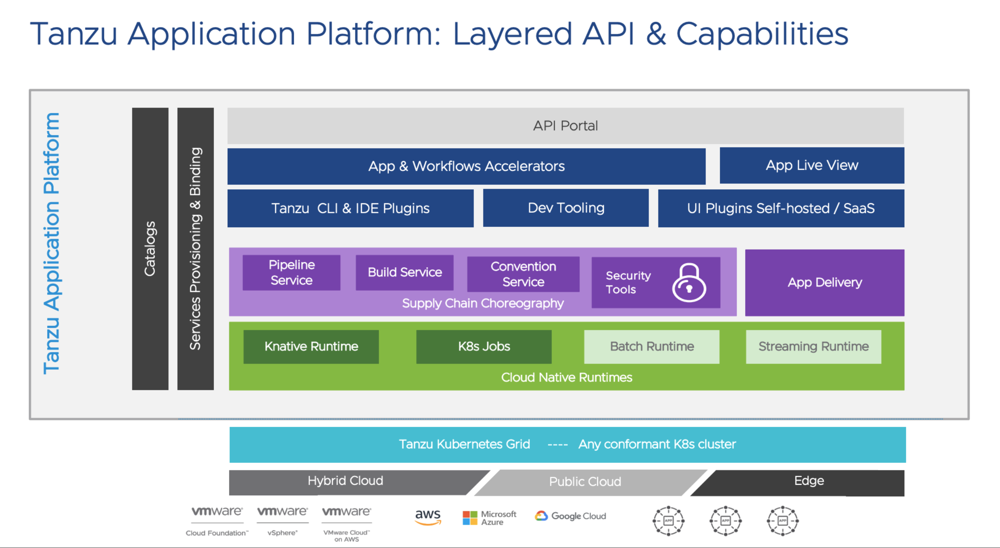

# Tanzu Application Platform Quickstart Installation Guide

> Note that Tanzu Application Platform is in Beta.  These instructions are based upon the Beta 4 release builds.




## Create a new workload cluster

We're going to do this on AWS.

```
cat > zoolabs-app-platform.yml <<EOF
CLUSTER_NAME: zoolabs-app-platform
CLUSTER_PLAN: dev
NAMESPACE: default
CNI: antrea
IDENTITY_MANAGEMENT_TYPE: none
CONTROL_PLANE_MACHINE_TYPE: t3.large
NODE_MACHINE_TYPE: m5.xlarge
AWS_REGION: "us-west-2"
AWS_NODE_AZ: "us-west-2b"
AWS_SSH_KEY_NAME: "se-cphillipson-cloudgate-aws-us-west-2"
BASTION_HOST_ENABLED: false
ENABLE_MHC: true
MHC_UNKNOWN_STATUS_TIMEOUT: 5m
MHC_FALSE_STATUS_TIMEOUT: 12m
ENABLE_AUDIT_LOGGING: false
ENABLE_DEFAULT_STORAGE_CLASS: true
CLUSTER_CIDR: 100.96.0.0/11
SERVICE_CIDR: 100.64.0.0/13
ENABLE_AUTOSCALER: false
EOF

tanzu cluster create --file zoolabs-app-platform.yml

tanzu cluster scale zoolabs-app-platform --worker-machine-count 3
```
> Replace occurrences of `zoolabs-app-platform` above with whatever name you'd like to give the workload cluster.  You'll also want to replace the value of `AWS_SSH_KEY_NAME` with your own SSH key.  Other property values may be updated as appropriate.


Obtain the new workload cluster kubectl configuration.

```
tanzu cluster kubeconfig get zoolabs-app-platform --admin
```
> Replace occurrence of `zoolabs-app-platform` above with name you gave the workload cluster.

Sample output

```
Credentials of cluster 'zoolabs-app-platform' have been saved
You can now access the cluster by running 'kubectl config use-context zoolabs-app-platform-admin@zoolabs-app-platform'
```

## Upgrade kapp-controller

### Verify installed version

```
kubectl get deployment kapp-controller -n tkg-system -o yaml | grep kapp-controller.carvel.dev/version
```
> You should see version 0.23.0 if you've installed Tanzu Kubernetes Grid 1.4 or Tanzu Community Edition.  We need to delete this version and install a newer version of the kapp-controller.

### Install newer version

Log into management cluster

```
kubectl config use-context zoolabs-mgmt-admin@zoolabs-mgmt
```
> Replace `zoolabs-mgmt` with your own management cluster name.

Apply this patch

```
kubectl patch app/zoolabs-app-platform-kapp-controller -n default -p '{"spec":{"paused":true}}' --type=merge
```
> Replace `zoolabs-app-platform` with your own workload cluster name.

Login to workload cluster, teardown the existing kapp-controller deployment, and deploy a new version of kapp-controller.

```
kubectl config use-context zoolabs-app-platform-admin@zoolabs-app-platform
kubectl delete deployment kapp-controller -n tkg-system
kubectl apply -f https://github.com/vmware-tanzu/carvel-kapp-controller/releases/download/v0.30.0/release.yml
```
> Replace occurrence of `zoolabs-app-platform-admin@zoolabs-app-platform` with your own workload cluster context.


### Verify new release version installed

```
kubectl get deployment kapp-controller -n kapp-controller -o yaml | grep kapp-controller.carvel.dev/version
```

### How to undo patch to management cluster

> This scenario only applies when you may have destroyed a workload cluster hosting TAP, then attempted to create a new workload cluster of the same name.

You will need to undo the patch.  If you forget to do this then the workload cluster creation will stall.

Check with:

```
kubectl get app zoolabs-app-platform-kapp-controller -n default
```
> Replace `zoolabs-app-platform` with your own workload cluster name.

To fix:

```
kubectl config use-context zoolabs-mgmt-admin@zoolabs-mgmt
kubectl patch app/zoolabs-app-platform-kapp-controller -n default -p '{"spec":{"paused":false}}' --type=merge
```
> Replace `zoolabs-mgmt` with your own management cluster name and replace `zoolabs-app-platform` with your own workload cluster name.

After a few moments check in on the status of the cluster with:

```
tanzu cluster list
```

Your cluster should be up-and-running.

## Install secret-gen-controller

```
kapp deploy -y -a sg -f https://github.com/vmware-tanzu/carvel-secretgen-controller/releases/download/v0.7.1/release.yml
```

Verify install

```
kubectl get deployment secretgen-controller -n secretgen-controller -o yaml | grep secretgen-controller.carvel.dev/version
```

## Add the Tanzu Application Platform specific plugins

> This procedure expects that you want to maintain the Tanzu CLI core and plugins you installed previously for interacting with Tanzu Kubernetes Grid or Tanzu Community Edition.

You'll want to copy and save the contents of the [install-tap-plugins.sh](install-tap-plugins.sh) to the machine where you had previously installed and used the `tanzu` CLI.

```
./install-tap-plugins.sh {tanzu-network-api-token}
```
> Replace `{tanzu-network-api-token}` with a valid VMWare Tanzu Network [API Token](https://network.pivotal.io/users/dashboard/edit-profile).

If you need to revert back to the `v1.4.0` version, run:

```
tanzu plugin clean
tanzu plugin install all --local {path-to-cli-directory}
```
> Replace `{path-to-cli-directory}` with a relative path to the `cli` directory that hosts the `v1.4.0` version.  If you're using a jump box, it's typically just `$HOME/cli`.


## Add the Tanzu Application Platform Package Repository

Create a new namespace

```
kubectl create ns tap-install
```

Create a registry secret

```
tanzu secret registry add tap-registry \
  --username "{tanzu-network-username}" --password "{tanzu-network-password}" \
  --server registry.tanzu.vmware.com \
  --export-to-all-namespaces --yes --namespace tap-install
```
> Replace `{tanzu-network-username}` and `{tanzu-network-password}` with the account credentials that you use to authenticate to the VMware Tanzu Network.


Add Tanzu Application Platform package repository to the cluster by running:

```
tanzu package repository add tanzu-tap-repository \
  --url registry.tanzu.vmware.com/tanzu-application-platform/tap-packages:1.0.0 \
  --namespace tap-install
```

Get the status of the Tanzu Application Platform package repository, and ensure the status updates to `Reconcile succeeded` by running:

```
tanzu package repository get tanzu-tap-repository --namespace tap-install
```

List the available packages by running:

```
tanzu package available list --namespace tap-install
```

List versions of available packages.  You'll want to copy and save the contents of the [list-available-packages.sh](list-available-packages.sh) to the machine where you had previously installed and used the `tanzu` CLI.

Then run:

```
./list-available-packages.sh
```

## Install a Tanzu Application Platform Profile

To view possible configuration settings, run:

```
tanzu package available get tap.tanzu.vmware.com/1.0.0 --values-schema --namespace tap-install
```
> Note that currently that the `tap.tanzu.vmware.com` package does not show all configuration settings for packages it plans to install. To find them out, look at the individual package configuration settings via same `tanzu package available get` command (e.g. for CNRs use `tanzu package available get -n tap-install cnrs.tanzu.vmware.com/1.1.0 --values-schema`). Replace dashes with underscores. For example, if the package name is `cloud-native-runtimes`, use `cloud_native_runtimes` in the `tap-values` YAML file.

It's helpful to start with some sample configuration, so

```
cp tap-values.yaml.sample tap-values.yaml
```

Edit the `tap-values.yaml` file by supplying appropriate configuration values; particularly occurrences of the `replace.me` placeholder.

Then, install the package by running:

```
ytt -f tap-values.yaml -f tap-config.yaml > tap-reified-values.yaml
tanzu package install tap -p tap.tanzu.vmware.com -v 1.0.0 --values-file tap-reified-values.yaml -n tap-install
```
> This will take some time.  Go grab a coffee and come back in 10 to 15 minutes.

Verify the package install by running:

```
tanzu package installed get tap -n tap-install
```
> Verify that the status for the installed package is "Reconcile succeeded".

Verify all the necessary packages in the profile are installed by running:

```
tanzu package installed list -A
```
> Sometimes the install will time out.  That's ok.  Attempt to execute the command above until you see something like the sample output below.  If any of the packages has a "Reconcile failed" you'll need to troubleshoot and fix before proceeding.  When you run the package install for TAP, it may fail fast because of sequencing.  Depending on whether you enabled ingress for your `tap-gui` configuration, `tap-gui` will require an `HttpProxy` resource, but those CRDs won’t exist until later in the process when the Cloud Native Runtimes package installs Contour.  If you're patient, everything will eventually get reconciled and figure itself out, but admittedly a fast failure is a poor experience for new users.  This is a known issue and will be addressed in a subsequent release.

Sample output

```
$ tanzu package installed list -A
- Retrieving installed packages...
  NAME                                PACKAGE-NAME                                         PACKAGE-VERSION  STATUS               NAMESPACE
  accelerator                         accelerator.apps.tanzu.vmware.com                    1.0.0            Reconcile succeeded  tap-install
  api-portal                          api-portal.tanzu.vmware.com                          1.0.8            Reconcile succeeded  tap-install
  appliveview                         run.appliveview.tanzu.vmware.com                     1.0.1            Reconcile succeeded  tap-install
  appliveview-conventions             build.appliveview.tanzu.vmware.com                   1.0.1            Reconcile succeeded  tap-install
  buildservice                        buildservice.tanzu.vmware.com                        1.4.2            Reconcile succeeded  tap-install
  cartographer                        cartographer.tanzu.vmware.com                        0.1.0            Reconcile succeeded  tap-install
  cert-manager                        cert-manager.tanzu.vmware.com                        1.5.3+tap.1      Reconcile succeeded  tap-install
  cnrs                                cnrs.tanzu.vmware.com                                1.1.0            Reconcile succeeded  tap-install
  contour                             contour.tanzu.vmware.com                             1.18.2+tap.1     Reconcile succeeded  tap-install
  conventions-controller              controller.conventions.apps.tanzu.vmware.com         0.5.0            Reconcile succeeded  tap-install
  developer-conventions               developer-conventions.tanzu.vmware.com               0.5.0-build1     Reconcile succeeded  tap-install
  fluxcd-source-controller            fluxcd.source.controller.tanzu.vmware.com            0.16.0           Reconcile succeeded  tap-install
  grype                               scst-grype.apps.tanzu.vmware.com                     1.0.0            Reconcile succeeded  tap-install
  image-policy-webhook                image-policy-webhook.signing.run.tanzu.vmware.com    1.0.0            Reconcile succeeded  tap-install
  learningcenter                      learningcenter.tanzu.vmware.com                      0.1.0-build.6    Reconcile succeeded  tap-install
  learningcenter-workshops            workshops.learningcenter.tanzu.vmware.com            0.1.0-build.7    Reconcile succeeded  tap-install
  metadata-store                      metadata-store.apps.tanzu.vmware.com                 1.0.1            Reconcile succeeded  tap-install
  ootb-delivery-basic                 ootb-delivery-basic.tanzu.vmware.com                 0.5.1            Reconcile succeeded  tap-install
  ootb-supply-chain-testing-scanning  ootb-supply-chain-testing-scanning.tanzu.vmware.com  0.5.1            Reconcile succeeded  tap-install
  ootb-templates                      ootb-templates.tanzu.vmware.com                      0.5.1            Reconcile succeeded  tap-install
  scanning                            scst-scan.apps.tanzu.vmware.com                      1.0.0            Reconcile succeeded  tap-install
  service-bindings                    service-bindings.labs.vmware.com                     0.6.0            Reconcile succeeded  tap-install
  services-toolkit                    services-toolkit.tanzu.vmware.com                    0.5.0            Reconcile succeeded  tap-install
  source-controller                   controller.source.apps.tanzu.vmware.com              0.2.0            Reconcile succeeded  tap-install
  spring-boot-conventions             spring-boot-conventions.tanzu.vmware.com             0.3.0            Reconcile succeeded  tap-install
  tap                                 tap.tanzu.vmware.com                                 1.0.0            Reconcile succeeded  tap-install
  tap-gui                             tap-gui.tanzu.vmware.com                             1.0.1            Reconcile succeeded  tap-install
  tap-telemetry                       tap-telemetry.tanzu.vmware.com                       0.1.2            Reconcile succeeded  tap-install
  tekton-pipelines                    tekton.tanzu.vmware.com                              0.30.0           Reconcile succeeded  tap-install
```

### Updating TAP packages

To update all packages, run:

```
tanzu package installed update tap -v 1.0.0 --values-file tap-reified-values.yaml -n tap-install
```
> You'll need to do this when you add, adjust, or remove any key-value you specify in `tap-reified-values.yaml`.  Your mileage may vary.  The "nuclear" (and recommended) option if you're in a hurry is to just just delete the `tap` package and any lingering resources, then re-install.

### Setting up Ingress

We're going to adapt the setup process to automate it even more by employing [Let's Encrypt](https://letsencrypt.org/how-it-works/), [cert-manager](https://cert-manager.io/docs/configuration/acme/dns01/route53/), and [external-dns](https://github.com/kubernetes-sigs/external-dns/blob/master/docs/tutorials/aws.md) with [Contour](https://projectcontour.io/getting-started/).

TAP already installed Contour.  We can verify that API resources were created by running:

```
kubectl api-resources | grep contour
```

#### Setting up an A or CNAME record for a wildcard Domain

The `envoy` service within the `contour-external` namespace references an ELB.

#### Install external-dns

TKG clusters include `external-dns` as part of the `tanzu-package-repo-global` namespace.  To verify this you can run:

```
tanzu package available list external-dns.tanzu.vmware.com -n tanzu-package-repo-global
```

Sample output

```
$ tanzu package available list external-dns.tanzu.vmware.com -n tanzu-package-repo-global
- Retrieving package versions for external-dns.tanzu.vmware.com...
  NAME                           VERSION               RELEASED-AT
  external-dns.tanzu.vmware.com  0.8.0+vmware.1-tkg.1  2021-06-11 11:00:00 -0700 PDT
```

We can check in on what we can configure

```
tanzu package available get external-dns.tanzu.vmware.com/0.8.0+vmware.1-tkg.1 --values-schema --namespace tanzu-package-repo-global
```

Let's install the external-dns package with a [script](install-external-dns-package-for-tkg-on-aws.sh)

```
./install-external-dns-package-for-tkg-on-aws.sh {aws-access-key-id} {aws-secret-access-key} {domain} {hosted-zone-id}
```
> This script simplifies the process of configuring and installing external-dns on your cluster hosted on AWS.  See step 6 [here](https://docs.vmware.com/en/VMware-Tanzu-Kubernetes-Grid/1.4/vmware-tanzu-kubernetes-grid-14/GUID-packages-external-dns.html#aws-route-53-4).  You will need to have [created an IAM Policy](../../../../harbor/README.md#create-an-iam-policy-for-managing-subdomain-records-in-a-route53-hosted-zone) with required permissions to interact with (a) target HostedZone(s) in Route53.

#### Manual DNS

If you chose not to install `external-dns`, then you will have to [manually add](https://docs.aws.amazon.com/Route53/latest/DeveloperGuide/resource-record-sets-creating.html) a wildcard domain as an `A` or `CNAME` record to the HostedZone within Route53.

To add an A record we'll want to configure Route53 to [route traffic to it via an alias record](https://docs.aws.amazon.com/Route53/latest/DeveloperGuide/routing-to-elb-load-balancer.html#routing-to-elb-load-balancer-configuring).

To add a CNAME record (e.g., when managing Route53 hosted zone record in a separate account)


> Change the wildcard domain and ELB address above to suit your needs.

#### Install a mkcert managed Certificate

> Recommended option if you've been following the Tanzu Advanced evaluation guide to this point.

We'll create a [ClusterIssuer](https://cert-manager.io/docs/concepts/issuer/) and [Certificate](https://kubernetes.io/docs/tasks/tls/managing-tls-in-a-cluster/), and [Secret](https://kubernetes.io/docs/concepts/configuration/secret/) on a TKG cluster on AWS where `cert-manager` is already installed.

```
./install-mkcert-for-tkg-on-aws.sh {domain} {path-to-cert-pem-filename} {path-to-key-pem-filename}
```

> The `.pem` files mentioned above should already exist if you had followed the instructions [here](../aws/HARBOR.md#install-ca).

#### Install a Let's Encrypt managed Certificate

> Use this option only when the container image registry you're interacting with has been configured to trust the same CA via Let's Encrypt.

We'll create a [ClusterIssuer](https://cert-manager.io/docs/concepts/issuer/) and [Certificate](https://kubernetes.io/docs/tasks/tls/managing-tls-in-a-cluster/), and [Secret](https://kubernetes.io/docs/concepts/configuration/secret/) on a TKG cluster on AWS where `cert-manager` is already installed.

```
./install-letsencrypt-cert-for-tkg-on-aws.sh {email-address} {aws-access-key-id} {aws-secret-access-key} {aws-region} {domain} {hosted-zone-id}
```
> This script also makes use of [kubernetes-reflector](https://github.com/emberstack/kubernetes-reflector#cert-manager-support) to automatically mirror the `knative-tls` secret in the `contour-external` namespace into the `educates` namespace.

#### Create a new Tanzu Application Platform GUI catalog

We're going to fetch some [baseline configuration](https://network.pivotal.io/products/tanzu-application-platform/#/releases/992949/file_groups/5756) for a _blank catalog_ from the Tanzu Network.

```
./fetch-tap-gui-catalog.sh {tanzu-network-api-token}
```
> Replace `{tanzu-network-api-token}` with a valid VMware Tanzu Network account [API Token](https://network.pivotal.io/users/dashboard/edit-profile).

Then we'll create a new Git repository to host the catalog.  (In this example we'll use Github, but you could target any git-compatible repository provider).

```
cd /tmp
tar xvf tap-gui-blank-catalog.tgz
cd blank
git init
gh repo create tap-gui-catalog
git branch -m master main
git add .
git status
git commit -m "Initial commit"
git push -u origin main --force
```

#### Verify Contour HTTP proxies

Finally we can execute:

```
kubectl get httpproxy -A
```

to see all of the HTTPS endpoints for the TAP components

Sample output

```
$ kubectl get httpproxy -A
NAMESPACE   NAME      FQDN                      TLS SECRET        STATUS   STATUS DESCRIPTION
tap-gui     tap-gui   tap-gui.j00k.ironleg.me   contour-tls/tls   valid    Valid HTTPProxy
```

### Installing the Visual Studio Code TAP Extension

You may use the convenience script to download a `.vsix` file for installation as an extension to [VSCode](https://code.visualstudio.com/).

```
./fetch-tap-vscode-extension.sh {tanzu-network-api-token}
```
> Replace `{tanzu-network-api-token}` with a valid VMWare Tanzu Network [API Token](https://network.pivotal.io/users/dashboard/edit-profile)


## Troubleshooting a Tanzu Application Platform Profile installation

### Problem with build-service

What would you do if you saw the following after executing `tanzu package installed list -A`?

```
buildservice                        buildservice.tanzu.vmware.com                        1.4.2                    Reconcile failed: Error (see .status.usefulErrorMessage for details)  tap-install
```

Start by getting more detail about the error by running:

```
tanzu package installed get buildservice -n tap-install
```

Sample output

```
$ tanzu package installed get buildservice -n tap-install
/ Retrieving installation details for buildservice...
NAME:                    buildservice
PACKAGE-NAME:            buildservice.tanzu.vmware.com
PACKAGE-VERSION:         1.4.2
STATUS:                  Reconcile failed: Error (see .status.usefulErrorMessage for details)
CONDITIONS:              [{ReconcileFailed True  Error (see .status.usefulErrorMessage for details)}]
USEFUL-ERROR-MESSAGE:    kapp: Error: waiting on reconcile tanzunetdependencyupdater/dependency-updater (buildservice.tanzu.vmware.com/v1alpha1) namespace: build-service:
  Finished unsuccessfully (Encountered failure condition Ready == False: CannotImportDescriptor (message:  "default" not ready: Get "https://harbor.lab.zoolabs.me/v2/": x509: certificate signed by unknown authority))
```

This is telling us that we're missing a CA.  What do we need to add to `tap-values.yml` then?

```
tanzu package available get buildservice.tanzu.vmware.com/1.4.2 --values-schema --namespace tap-install
```

Sample output

```
$ tanzu package available get buildservice.tanzu.vmware.com/x.x.x --values-schema --namespace tap-install
| Retrieving package details for buildservice.tanzu.vmware.com/x.x.x...
  KEY                             DEFAULT  TYPE    DESCRIPTION
  kp_default_repository           <nil>    string  docker repository (required)
  kp_default_repository_password  <nil>    string  registry password (required)
  kp_default_repository_username  <nil>    string  registry username (required)
  tanzunet_password               <nil>    string  tanzunet registry password (required for dependency updater feature)
  tanzunet_username               <nil>    string  tanzunet registry username (required for dependency updater feature)
  ca_cert_data                    <nil>    string  tbs registry ca certificate (used for self signed registry)
```

So we'll need to add a child property key named `ca_cert_data:` and an associated multi-line value underneath `buildservice:`.

Then run:

```
tanzu package installed update tap -v 1.0.0 --values-file tap-values.yml -n tap-install
```

### Problem with tap-gui

Maybe you notice that the _Tanzu Application Platform GUI_ is missing an entry for the application you just deployed?

* Did you [install the blank catalog](#create-a-new-tanzu-application-platform-gui-catalog)?
* Did you [add an entry to catalog-info.yaml](USAGE.md#getting-your-app-to-appear-in-the-tanzu-application-platform-gui-catalog)?
* Is your entry referencing the correct branch and file? (e.g., a Github URL might look like `https://github.com/{owner-or-organization}/{project}/blob/{branch}/{filename}`)

Verify that the _app-config_ version has your updates.

```
kubectl get secrets -n tap-gui
kubectl get secret app-config-ver-{version} -n tap-gui -o "jsonpath={.data.app-config\.yaml}" | base64 -d
```
> Replace `{version}` above with the latest version of the secret available

If not, try

```
kubectl delete po -l component=backstage-server -n tap-gui
```

Then wait ~ 2 minutes and re-verify.


## Uninstall Tanzu Application Platform

Delete the package install

```
tanzu package installed delete tap -n tap-install -y
```
> Be patient! This can take up to 10m or more.  It may even timeout.  Just wait a little longer.  Then verify that the only two packages remaining are: `antrea`, `external-dns` and `metrics-server` by executing `tanzu package installed list -A`.

Delete lingering resources

```
kubectl delete secret tap-tap-install-values -n tap-install
kubectl delete sa tap-tap-install-sa -n tap-install
kubectl delete clusterroles.rbac.authorization.k8s.io tap-tap-install-cluster-role
kubectl delete clusterrolebindings.rbac.authorization.k8s.io tap-tap-install-cluster-rolebinding
```

Delete the package repository

```
tanzu package repository delete tanzu-tap-repository -n tap-install
```


## Uninstall external-dns

Run this [script](uninstall-external-dns-package-for-tkg-on-aws.sh)

```
./uninstall-external-dns-package-for-tkg-on-aws.sh
```


## Uninstall the Let's Encrypt managed certificate

Run this [script](uninstall-letsencrypt-cert-for-tkg-on-aws.sh)

```
./uninstall-letsencrypt-cert-for-tkg-on-aws.sh
```

## Uninstall mkcert managed certificate

Run this [script](uninstall-mkcert-for-tkg-on-aws.sh)

```
./uninstall-mk-cert-for-tkg-on-aws.sh
```


## Teardown the cluster

```
tanzu cluster delete zoolabs-app-platform
kubectl config delete-context zoolabs-app-platform-admin@zoolabs-app-platform
```
> Replace occurrences of `zoolabs-app-platform` and `zoolabs-app-platform-admin@zoolabs-app-platform` with your own workload cluster name and context.

