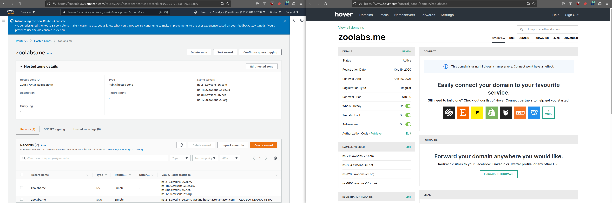

# Installing Harbor

This is the shortest path to configure [Harbor](https://goharbor.io/) paired with [ExternalDNS](https://github.com/kubernetes-sigs/external-dns) on a TKG workload cluster on AWS.

> The main benefit is that if the IP address to the shared services ingress load balancer changes, ExternalDNS automatically picks up the change and re-maps the new address to the Harbor hostname.


## (Re)set AWS credentials using environment variables

As you initiate certain requests to create resources in your AWS account, you may need to switch to an account that has a specific or elevated set of permissions, rather than relying on an instance profile.

If [using STS](https://docs.aws.amazon.com/sdk-for-java/v1/developer-guide/prog-services-sts.html), at a minimum you should set and/or obtain

```
export AWS_REGION={REGION}
export AWS_ACCESS_KEY_ID={ACCESS_KEY}
export AWS_SECRET_ACCESS_KEY={SECRET_KEY}
export AWS_SESSION_TOKEN={SESSION_TOKEN}
export AWS_PAGER=
```
> Replace the curl-bracketed values above with actual valid values as appropriate.


## Install CA

Follow instructions for trusting [Custom CA Certificates on Tanzu Kubernetes Grid Cluster Nodes](CERT.md).

Next let's create key file and cert file for wildcard subdomains.

```
mkcert -key-file key.pem -cert-file cert.pem {DOMAIN} {SUBDOMAIN} *.{SUBDOMAIN} localhost 127.0.0.1 ::1
```

For example

```
ubuntu@ip-172-31-61-62:~$ mkcert -key-file key.pem -cert-file cert.pem zoolabs.me lab.zoolabs.me *.lab.zoolabs.me localhost 127.0.0.1 ::1

Created a new certificate valid for the following names 📜
 - "zoolabs.me"
 - "lab.zoolabs.me"
 - "*.lab.zoolabs.me"
 - "localhost"
 - "127.0.0.1"
 - "::1"

Reminder: X.509 wildcards only go one level deep, so this won't match a.b.lab.zoolabs.me ℹ️

The certificate is at "cert.pem" and the key at "key.pem" ✅

It will expire on 19 December 2023 🗓
```
> Make note of file names.  We're going to use these later.  They are located in the directory you executed the command from.


## Create a dedicated workload cluster

Follow instructions for [creating a workload cluster](README.md#create-workload-cluster).

For example

```
cat > zoolabs-harbor.yaml <<EOF
CLUSTER_NAME: zoolabs-harbor
CLUSTER_PLAN: prod
NAMESPACE: default
CNI: antrea
IDENTITY_MANAGEMENT_TYPE: none
CONTROL_PLANE_MACHINE_TYPE: t3.large
NODE_MACHINE_TYPE: m5.large
AWS_REGION: "us-west-2"
AWS_NODE_AZ: "us-west-2a"
AWS_NODE_AZ_1: "us-west-2b"
AWS_NODE_AZ_2: "us-west-2c"
AWS_SSH_KEY_NAME: "se-cphillipson-cloudgate-aws-us-west-2"
BASTION_HOST_ENABLED: true
ENABLE_MHC: true
MHC_UNKNOWN_STATUS_TIMEOUT: 5m
MHC_FALSE_STATUS_TIMEOUT: 12m
ENABLE_AUDIT_LOGGING: false
ENABLE_DEFAULT_STORAGE_CLASS: true
CLUSTER_CIDR: 100.96.0.0/11
SERVICE_CIDR: 100.64.0.0/13
ENABLE_AUTOSCALER: false
EOF

tanzu cluster create --file zoolabs-harbor.yaml
```


## Set the kubectl context

For example

```
kubectl config get-contexts
kubectl config use-context zoolabs-harbor-admin@zoolabs-harbor
```


## Install cert-manager

Consult the instructions [here](https://docs.vmware.com/en/VMware-Tanzu-Kubernetes-Grid/1.4/vmware-tanzu-kubernetes-grid-14/GUID-packages-cert-manager.html).

tl;dr

```
tanzu package install cert-manager --package-name cert-manager.tanzu.vmware.com --version 1.1.0+vmware.1-tkg.2 --namespace cert-manager --create-namespace
```

## Install Contour

Consult the instructions [here](https://docs.vmware.com/en/VMware-Tanzu-Kubernetes-Grid/1.4/vmware-tanzu-kubernetes-grid-14/GUID-packages-ingress-contour.html).

tl;dr

```
cat > contour-data-values.yaml <<EOF
---
infrastructure_provider: aws
namespace: tanzu-system-ingress
contour:
 configFileContents: {}
 useProxyProtocol: false
 replicas: 2
 pspNames: "vmware-system-restricted"
 logLevel: info
envoy:
 service:
   type: LoadBalancer
   annotations: {}
   nodePorts:
     http: null
     https: null
   externalTrafficPolicy: Cluster
   aws:
     LBType: classic
   disableWait: false
 hostPorts:
   enable: true
   http: 80
   https: 443
 hostNetwork: false
 terminationGracePeriodSeconds: 300
 logLevel: info
 pspNames: null
certificates:
 duration: 8760h
 renewBefore: 360h
EOF

tanzu package install contour --package-name contour.tanzu.vmware.com --version 1.17.1+vmware.1-tkg.1 --namespace contour --values-file contour-data-values.yaml --create-namespace
```


## Temporarily assume administrator access

> You're going to need to use an account with [iam:AdministratorAccess](https://console.aws.amazon.com/iam/home#/policies/arn:aws:iam::aws:policy/AdministratorAccess$jsonEditor) policy permissions attached to complete the following steps.

### Create an IAM policy for managing subdomain records in a Route53 hosted zone

Consult the following [documentation](https://docs.aws.amazon.com/Route53/latest/DeveloperGuide/access-control-managing-permissions.html#example-permissions-record-owner).

Create policy

```
cat > subdomain-owner-policy.json <<EOF
{
    "Version": "2012-10-17",
    "Statement": [
        {
            "Sid" : "AllowTanzuServiceMeshPermissions",
            "Effect": "Allow",
            "Action": [
                "route53:GetChange",
                "route53:ListHostedZones",
                "route53:ListHostedZonesByName",
                "route53:ListResourceRecordSets",
                "route53:ChangeResourceRecordSets",
                "route53:ListHealthChecks",
                "route53:CreateHealthCheck",
                "route53:DeleteHealthCheck",
                "route53:GetHealthCheckStatus",
                "route53:ChangeTagsForResource",
                "route53:ListTagsForResource"
            ],
            "Resource": "*"
        },
        {
            "Sid" : "AllowTanzuServiceMeshPermissions2",
            "Effect": "Allow",
            "Action": [
                "route53:GetChange",
                "route53:ListHostedZones",
                "route53:ListHostedZonesByName",
                "route53:ListResourceRecordSets",
                "route53:ChangeResourceRecordSets",
                "route53:ListHealthChecks",
                "route53:CreateHealthCheck",
                "route53:DeleteHealthCheck",
                "route53:GetHealthCheckStatus",
                "route53:ChangeTagsForResource",
                "route53:ListTagsForResource"
            ],
            "Resource": "arn:aws:route53:::hostedzone/{hosted-zone-name}"
        }
    ]
}
EOF
```
> Replace `{hosted-zone-name}` above with your own hosted zone name.

Then

```
aws iam create-policy --policy-name subdomain-owner-access --policy-document file://subdomain-owner-policy.json
```
> Make a note of the `Arn` value in the output


### Create account, attach policy, and obtain credentials

Create a user account

```
aws iam create-user --user-name {SUBDOMAIN}-owner
```
> Replace `{SUBDOMAIN}` with a domain name substituting occurrences of "." with "_".

Attach policy

```
aws iam attach-user-policy --policy-arn "{ARN}" --user-name {SUBDOMAIN}-owner
```
> Replace `{ARN}` with the value you captured a couple of steps before.  Replace the value of `{SUBDOMAIN}` with what you chose in the prior step.

Obtain credentials for this user account

```
aws iam create-access-key --user-name {SUBDOMAIN}-owner
```
> Replace the value of `{SUBDOMAIN}` with what you chose in the prior step.  Make sure you capture the access key and secret key in the JSON output.  You'll require these values later on when you configure and install external-dns.


### Create hosted zones in Route53

We're going to use [Terraform](https://registry.terraform.io/providers/hashicorp/aws/latest/docs/resources/route53_zone) to expedite the process of creating a

* hosted zone for a top level domain
* hosted zone for a subdomain

Let's create a couple of modules

```
mkdir -p terraform/modules/zones
cd terraform/modules/zones
mkdir top
mkdir sub

cat > top/main.tf <<EOF
provider "aws" {
  region  = var.region
}

variable "region" {
  description = "An AWS region (e.g., us-east-1)"
  default = "us-west-2"
}

variable "domain" {
  description = "A domain name (e.g., zoolabs.me)"
}

resource "aws_route53_zone" "main" {
  name = var.domain
}

output "hosted_zone_id" {
  value = aws_route53_zone.main.id
}
EOF

cat > sub/main.tf <<EOF
module "managed-zone" {
  source = "git::https://github.com/pacphi/tf4k8s.git//modules/dns/amazon"

  base_hosted_zone_id = var.base_hosted_zone_id
  domain_prefix = var.domain_prefix
  region = var.region
}

variable "base_hosted_zone_id" {
  description = "The id of an existing Route53 zone; it'll have an NS record added to it referencing the name servers of a new zone"
}

variable "domain_prefix" {
  description = "Prefix for a domain (e.g. in lab.zoolab.me, 'lab' is the prefix)"
}

variable "region" {
  description = "An AWS region (e.g., us-east-1)"
  default = "us-west-2"
}

output "sub_domain" {
  description = "New sub domain"
  value = module.managed-zone.base_domain
}

output "hosted_zone_id" {
  value = module.managed-zone.hosted_zone_id
}
EOF
```

Next, create the hosted zone for the top level domain and record the id

```
cd top
export TF_VAR_region={REGION}
export TF_VAR_domain={DOMAIN}
terraform init
terraform validate
terraform plan -out terraform.plan
terraform apply -auto-approve -state terraform.tfstate terraform.plan
```
> Replace `{REGION}` with a valid AWS [region](https://docs.aws.amazon.com/AmazonRDS/latest/UserGuide/Concepts.RegionsAndAvailabilityZones.html).  Replace `{DOMAIN}` with a registered domain name.  Make a note of the hosted_zone_id in the output.  You will need it for the next step.

Then, create the hosted zone for the subdomain (this will be the subdomain within which external-dns will be able to add records)

```
cd ../sub
export TF_VAR_region={REGION}
export TF_VAR_base_hosted_zone_id={HOSTED_ZONE_ID}
export TF_VAR_domain_prefix={DOMAIN_PREFIX}
terraform init
terraform validate
terraform plan -out terraform.plan
terraform apply -auto-approve -state terraform.tfstate terraform.plan
```
> Replace `{REGION}` with a valid AWS [region](https://docs.aws.amazon.com/AmazonRDS/latest/UserGuide/Concepts.RegionsAndAvailabilityZones.html).  Replace `{HOSTED_ZONE_ID}` with the id you had captured from the prior step (or consult Route53).  Replace `{DOMAIN_PREFIX}` with a unique name (avoid special characters or punctuations).  Make a note of the hosted_zone_id in the output (this is the one for the subdomain).  You will need it when configuring external-dns.

Finally, we'll add the NS records from the newly created hosted zone for the top level domain to the registrar's record of nameservers (see the screenshot for an example).



Cleanup TF_VARs

```
unset TF_VAR_region
unset TF_VAR_domain
unset TF_VAR_base_hosted_zone_id
unset TF_VAR_domain_prefix
```

Revert back to the instance profile credentials.

```
unset AWS_ACCESS_KEY_ID
unset AWS_SECRET_ACCESS_KEY
unset AWS_SESSION_TOKEN
```

To be safe we'll want to clear the bash history

```
rm -f ~/.bash_history
echo 'history -c' >> ~/.bash_logout
```


## Install external-dns

Consult the instructions [here](https://docs.vmware.com/en/VMware-Tanzu-Kubernetes-Grid/1.4/vmware-tanzu-kubernetes-grid-14/GUID-packages-external-dns.html).

tl;dr

Create a new namespace

```
kubectl create namespace tanzu-system-service-discovery
```

Create a secret (to make the Route53 credentials of the subdomain owner available to ExternalDNS)

```
kubectl -n tanzu-system-service-discovery create secret generic route53-credentials \
  --from-literal=aws_access_key_id={YOUR-ACCESS-KEY-ID} \
  --from-literal=aws_secret_access_key={YOUR-SECRET-ACCESS-KEY}
```
> Replace the curl-bracketed values with the credentials of the `{SUBDOMAIN}-owner`

Create the data values file

```
cat > external-dns-data-values.yaml <<EOF
---

# Namespace in which to deploy ExternalDNS.
namespace: tanzu-system-service-discovery

# Deployment-related configuration.
deployment:
 args:
   - --source=service
   - --source=ingress
   - --source=contour-httpproxy   # Provide this to enable Contour HTTPProxy support. Must have Contour installed or ExternalDNS will fail.
   - --domain-filter={SUBDOMAIN}     # Makes ExternalDNS see only the hosted zones matching provided domain, omit to process all available hosted zones.
   - --policy=upsert-only         # Prevents ExternalDNS from deleting any records, omit to enable full synchronization.
   - --registry=txt
   - --txt-owner-id={HOSTED_ZONE_ID}
   - --txt-prefix=txt             # Disambiguates TXT records from CNAME records.
   - --provider=aws
   - --aws-zone-type=public       # Looks only at public hosted zones. Valid values are public, private, or no value for both.
   - --aws-prefer-cname
 env:
   - name: AWS_ACCESS_KEY_ID
     valueFrom:
       secretKeyRef:
         name: route53-credentials
         key: aws_access_key_id
   - name: AWS_SECRET_ACCESS_KEY
     valueFrom:
       secretKeyRef:
         name: route53-credentials
         key: aws_secret_access_key
 securityContext: {}
 volumeMounts: []
 volumes: []
EOF
```
> Replace `{SUBDOMAIN}` and `{HOSTED_ZONE_ID}` with appropriate values you'd captured in earlier steps.

Install the package

```
tanzu package install external-dns \
  --package-name external-dns.tanzu.vmware.com \
  --version 0.8.0+vmware.1-tkg.1 \
  --values-file external-dns-data-values.yaml
  --namespace tanzu-system-service-discovery
```

Confirm

```
kubectl get apps -A
```

## Install Harbor

Consult the instructions [here](https://docs.vmware.com/en/VMware-Tanzu-Kubernetes-Grid/1.4/vmware-tanzu-kubernetes-grid-14/GUID-packages-harbor-registry.html).

tl;dr

Create the data values file

```
image_url=$(kubectl -n tanzu-package-repo-global get packages harbor.tanzu.vmware.com.2.2.3+vmware.1-tkg.1 -o jsonpath='{.spec.template.spec.fetch[0].imgpkgBundle.image}')
imgpkg pull -b $image_url -o /tmp/harbor-package-2.2.3
cp /tmp/harbor-package-2.2.3/config/values.yaml harbor-data-values.yaml
yq -i eval '... comments=""' harbor-data-values.yaml
```

Edit `harbor-data-values.yml`

Add values for:

* hostname (the hostname you want to use to access Harbor)
* tlsCertificate (you can obtain the values for the crt, key and ca from mkcert)
  * tls.crt ( cert.pem )
  * tls.key ( key.pem )
  * ca.crt ( cat "$(mkcert -CAROOT)"/rootCA.crt )
* harborAdminPassword
* secretKey (used for encryption and must be a string of at least 16 characters in length)
* core
  * secret (used by core server to communicate with other components)
  * xsrfKey (must be a string of 32 characters in length)
* jobservice
  * secret (used when job service communicates with other components)
* registry
  * secret (used to secure the upload state from client and registry storage backend)
* persistence
  * persistentVolumeClaim
    * registry
      * size (set to 100Gi)


Install the package

```
kubectl create namespace tanzu-system-registry
tanzu package install harbor \
  --package-name harbor.tanzu.vmware.com \
  --version 2.2.3+vmware.1-tkg.1 \
  --values-file harbor-data-values.yaml \
  --namespace tanzu-system-registry
```

Address issue post-install

> See [the harbor-notary-signer pod fails to start](https://kb.vmware.com/s/article/85725)

Create file overlay

```
cat > overlay-notary-signer-image-fix.yaml <<EOF
#@ load("@ytt:overlay", "overlay")

#@overlay/match by=overlay.and_op(overlay.subset({"kind": "Deployment"}), overlay.subset({"metadata": {"name": "harbor-notary-signer"}}))
---
spec:
  template:
    spec:
      containers:
        #@overlay/match by="name",expects="0+"
        - name: notary-signer
          image: projects.registry.vmware.com/tkg/harbor/notary-signer-photon@sha256:4dfbf3777c26c615acfb466b98033c0406766692e9c32f3bb08873a0295e24d1
EOF
```

Apply overlay and patch the package

```
kubectl -n tanzu-system-registry create secret generic harbor-notary-signer-image-overlay -o yaml --dry-run=client --from-file=overlay-notary-signer-image-fix.yaml | kubectl apply -f -
kubectl -n tanzu-system-registry annotate packageinstalls harbor ext.packaging.carvel.dev/ytt-paths-from-secret-name.0=harbor-notary-signer-image-overlay
```

The harbor-notary-signer pod might be stuck in a CrashLoopBackoff state.  If this is the case, execute

```
kubectl delete pod harbor-notary-signer-xxxxxxxxxx-xxxxx -n tanzu-system-registry
```
> Replace the "xxxxxxxxxx-xxxxx" suffix of the pod name above with the real suffix you see from having executed `kubectl get pod -n tanzu-system-registry`

Lastly, we need to restart contour

```
kubectl rollout restart deployment.apps/contour -n tanzu-system-ingress
```

## Test login


### with Docker

```
docker login -u admin -p {HARBOR_PASSWORD} https://{HARBOR_DOMAIN}
```

For example

```
ubuntu@ip-172-31-61-62:~$ docker login -u admin -p 'xxx' https://harbor.lab.zoolabs.me
WARNING! Using --password via the CLI is insecure. Use --password-stdin.
WARNING! Your password will be stored unencrypted in /home/ubuntu/.docker/config.json.
Configure a credential helper to remove this warning. See
https://docs.docker.com/engine/reference/commandline/login/#credentials-store

Login Succeeded
```

Did you face this [issue](https://github.com/goharbor/harbor/issues/6774#issuecomment-455951285) when attempting to login?

You'll need to copy the key, cert and root CA files into `/etc/docker/certs.d/{HARBOR_DOMAIN}`.

Assuming you were on the toolset jumpbox when you installed Harbor, you could use `scp` to fetch those files and then move them into place.

For example

```
scp -r -i $HOME/.ssh/se-cphillipson-cloudgate-aws-us-west-2 ubuntu@ec2-44-242-138-94.us-west-2.compute.amazonaws.com:/home/ubuntu/key.pem .
scp -r -i $HOME/.ssh/se-cphillipson-cloudgate-aws-us-west-2 ubuntu@ec2-44-242-138-94.us-west-2.compute.amazonaws.com:/home/ubuntu/cert.pem .
scp -r -i $HOME/.ssh/se-cphillipson-cloudgate-aws-us-west-2 ubuntu@ec2-44-242-138-94.us-west-2.compute.amazonaws.com:/home/ubuntu/.local/share/mkcert/rootCA.crt .
mv rootCA.crt ca.crt
mv key.pem client.key
mv cert.pem client.cert
sudo mkdir -p /etc/docker/certs.d/harbor.lab.zoolabs.me
sudo mv ca.crt /etc/docker/certs.d/harbor.lab.zoolabs.me
sudo mv client.* /etc/docker/certs.d/harbor.lab.zoolabs.me
```

Try to login again.

### with a Browser

You're going to have to import the root CA.  The procedure for doing this varies depending on the browser vendor.

* [Firefox](https://javorszky.co.uk/2019/11/06/get-firefox-to-trust-your-self-signed-certificates/)
* [Internet Explorer or Microsoft Edge](https://www.techrepublic.com/article/how-to-add-a-trusted-certificate-authority-certificate-to-internet-explorer-or-microsoft-edge/)
* [Safari](https://support.apple.com/guide/keychain-access/add-certificates-to-a-keychain-kyca2431/mac)
