# Exploring Tanzu Service Mesh

We're going to provision two workload clusters, integrate them with Tanzu Service Mesh, deploy some apps,  configure a Global Namespace, define a public service and execute an application failover scenario the result of which should demonstrate resiliency and high-availability across clusters (no matter where they're running).

Assumes you have access to Harbor (or other container image registry) from which to source container images for the applications you'll deploy.


## Create workload clusters

We're just going to create a couple clusters in the same region but in different availability zones.  We assume a management cluster is already provisioned.

```
cat > zoolabs-workload-1.yml <<EOF
CLUSTER_NAME: zoolabs-workload-1
CLUSTER_PLAN: dev
NAMESPACE: default
CNI: antrea
IDENTITY_MANAGEMENT_TYPE: none
CONTROL_PLANE_MACHINE_TYPE: t3.large
NODE_MACHINE_TYPE: m5.large
AWS_REGION: "us-west-2"
AWS_NODE_AZ: "us-west-2a"
AWS_SSH_KEY_NAME: "se-cphillipson-cloudgate-aws-us-west-2"
BASTION_HOST_ENABLED: false
ENABLE_MHC: true
MHC_UNKNOWN_STATUS_TIMEOUT: 5m
MHC_FALSE_STATUS_TIMEOUT: 12m
ENABLE_AUDIT_LOGGING: false
ENABLE_DEFAULT_STORAGE_CLASS: true
CLUSTER_CIDR: 100.96.0.0/11
SERVICE_CIDR: 100.64.0.0/13
ENABLE_AUTOSCALER: false
EOF

cat > zoolabs-workload-2.yml <<EOF
CLUSTER_NAME: zoolabs-workload-2
CLUSTER_PLAN: dev
NAMESPACE: default
CNI: antrea
IDENTITY_MANAGEMENT_TYPE: none
CONTROL_PLANE_MACHINE_TYPE: t3.large
NODE_MACHINE_TYPE: m5.large
AWS_REGION: "us-west-2"
AWS_NODE_AZ: "us-west-2b"
AWS_SSH_KEY_NAME: "se-cphillipson-cloudgate-aws-us-west-2"
BASTION_HOST_ENABLED: false
ENABLE_MHC: true
MHC_UNKNOWN_STATUS_TIMEOUT: 5m
MHC_FALSE_STATUS_TIMEOUT: 12m
ENABLE_AUDIT_LOGGING: false
ENABLE_DEFAULT_STORAGE_CLASS: true
CLUSTER_CIDR: 100.96.0.0/11
SERVICE_CIDR: 100.64.0.0/13
ENABLE_AUTOSCALER: false
EOF

tanzu cluster create --file zoolabs-workload-1.yaml
tanzu cluster create --file zoolabs-workload-2.yaml
```
> You'll want to change a few of the values for the properties of each cluster's configuration above; minimally `CLUSTER_NAME` and `AWS_SSH_KEY_NAME`.  It'll take ~10-12 minutes to provision the supporting infrastructure for each cluster.

Obtain the new workload cluster kubectl configuration.

```
tanzu cluster kubeconfig get zoolabs-workload-1 --admin
tanzu cluster kubeconfig get zoolabs-workload-2 --admin
```


## Integrate clusters with Tanzu Service Mesh

While we could [enable TSM for an organization](https://docs.vmware.com/en/VMware-Tanzu-Mission-Control/services/tanzumc-using/GUID-ABEEC120-5B2C-4D26-BD5D-C6BE71102154.html) then [integrate both clusters with TSM](https://docs.vmware.com/en/VMware-Tanzu-Mission-Control/services/tanzumc-using/GUID-5B1445AB-EFEB-41BD-B9B3-6DD38E69991F.html) via Tanzu Mission Control, we're going to follow these instructions:

* [Create an IAM policy for managing domain records in a Route53 hosted zone](HARBOR.md#create-an-iam-policy-for-managing-subdomain-records-in-a-route53-hosted-zone)
  * Referring to [Amazon Route 53 API permissions: Actions, resources, and conditions reference](https://docs.aws.amazon.com/Route53/latest/DeveloperGuide/r53-api-permissions-ref.html)
* [Create account, attach policy, and obtain credentials](HARBOR.md#create-account-attach-policy-and-obtain-credentials)
* [Manage integration](https://docs.vmware.com/en/VMware-Tanzu-Service-Mesh/services/using-tanzu-service-mesh-guide/GUID-C1321224-0298-40C9-91DC-4C2467886CEA.html)

A visual montage...

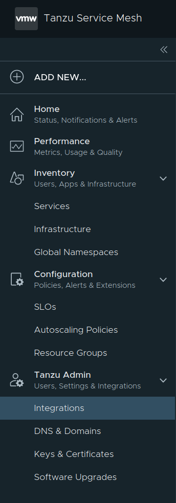

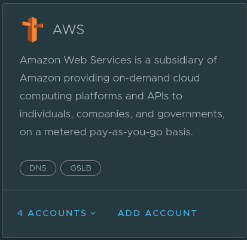

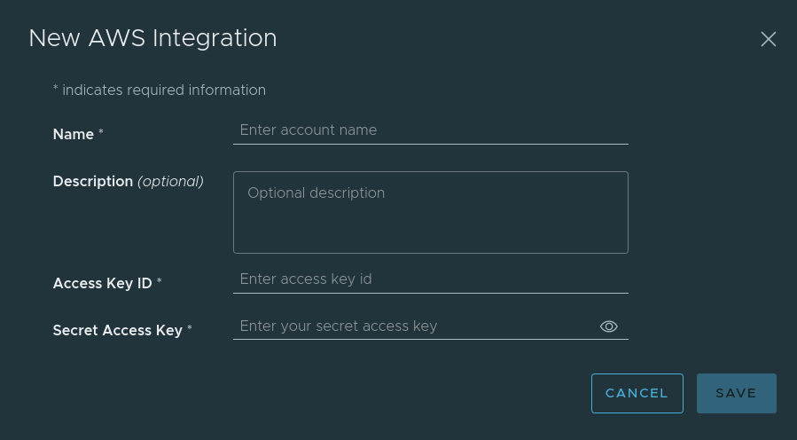

> You are creating a _Domain provider_.


## Manage Domain(s)

Follow these [instructions](https://docs.vmware.com/en/VMware-Tanzu-Service-Mesh/services/using-tanzu-service-mesh-guide/GUID-14107FE9-6CC7-477A-81C8-15A6DE7EE3F0.html).

A visual montage...

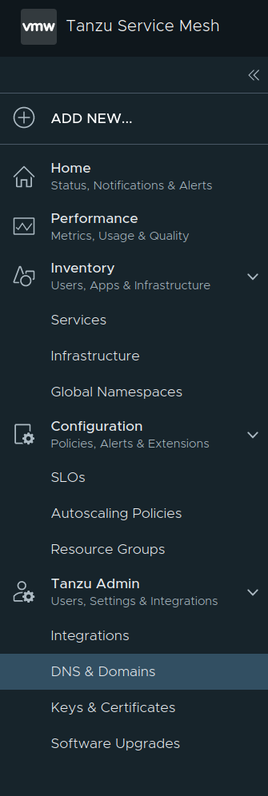

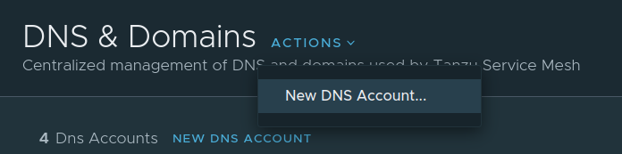

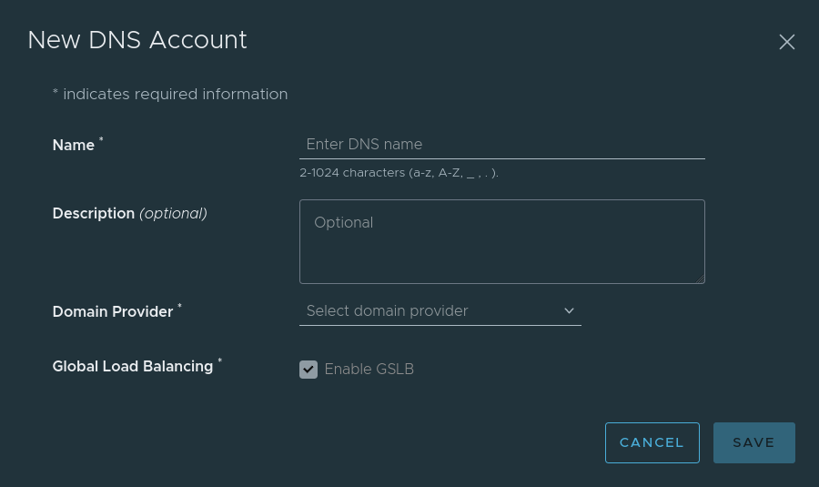

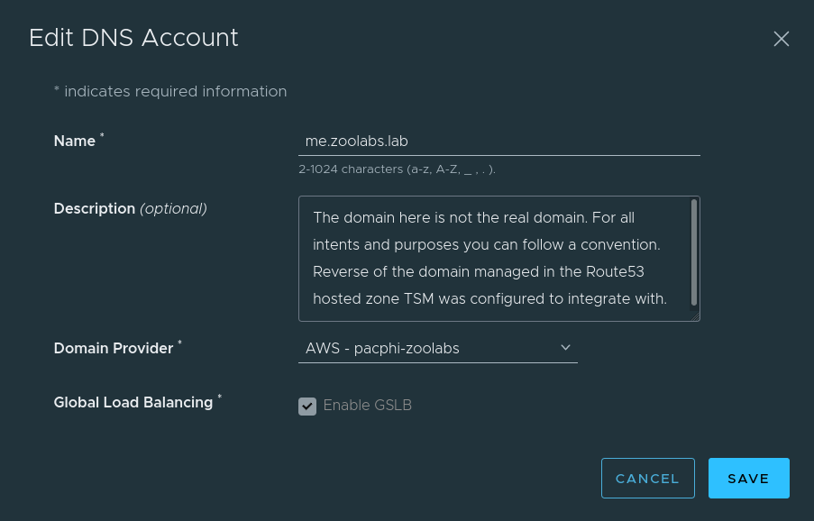

## (Optional) Manage Certificates

If you want to be able to encrypt traffic using TLS, then you will need to manage keys and certificates.

Follow these [instructions](https://docs.vmware.com/en/VMware-Tanzu-Service-Mesh/services/using-tanzu-service-mesh-guide/GUID-F918A006-AB74-4286-A7E7-D57F2326ECC6.html).


## Onboard clusters to TSM

Rinse-and-repeat these instructions for each cluster
  * See [Onboard a Cluster to Tanzu Service Mesh
](https://docs.vmware.com/en/VMware-Tanzu-Service-Mesh/services/getting-started-guide/GUID-DE9746FD-8369-4B1E-922C-67CF4FB22D21.html)

A visual montage...

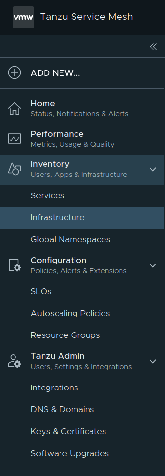

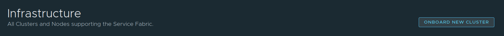

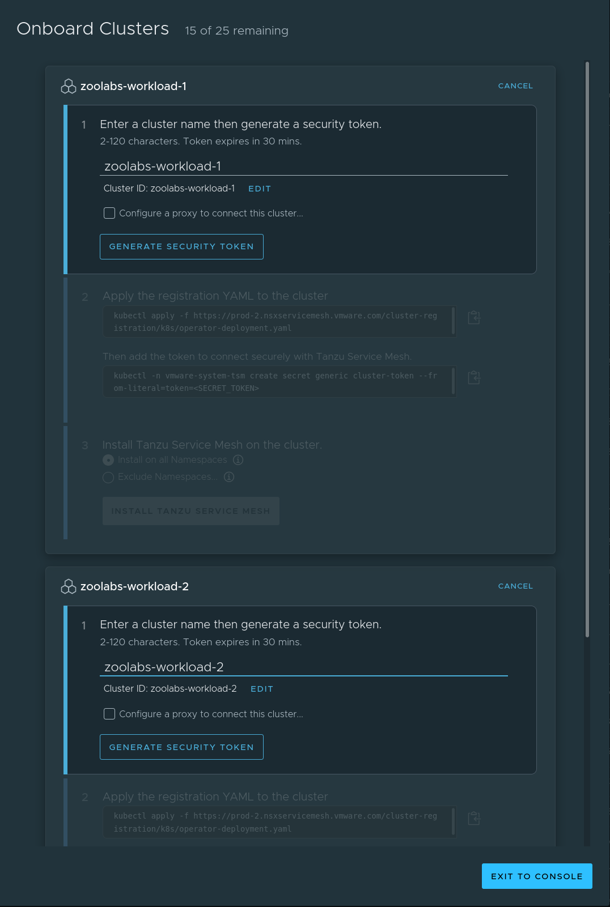

That last screenshot is multi-step.  Make sure you pay attention to detail.  Supply names for the clusters (in each dialog box).  Generate the security token.  Target a workload cluster, apply the YAML (to register then connect), then choose whether to install TSM cluster-wide or in just certain namespaces (honoring excludes), then click on Install Tanzu Service Mesh.  Rinse-and-repeat for the second and subsequent clusters.


## Deploy applications to both clusters

Rinse-and-repeat these instructions targeting each cluster:

* [primes](APP.md)
  * Employ Option 1
* [console-availability](OBSERVABILITY.md)
  * Choose to follow one section's steps (employing _public_ or _private_ manifests)


## Create Global Namespace

Once both clusters are integrated we will create a Global Namespace.

Follow these [instructions](https://docs.vmware.com/en/VMware-Tanzu-Service-Mesh/services/using-tanzu-service-mesh-guide/GUID-8D483355-6F58-4AAD-9EAF-3B8E0A87B474.html).

> Note: the Global Namespace name should never be named the same as the Domain name.

A visual montage...

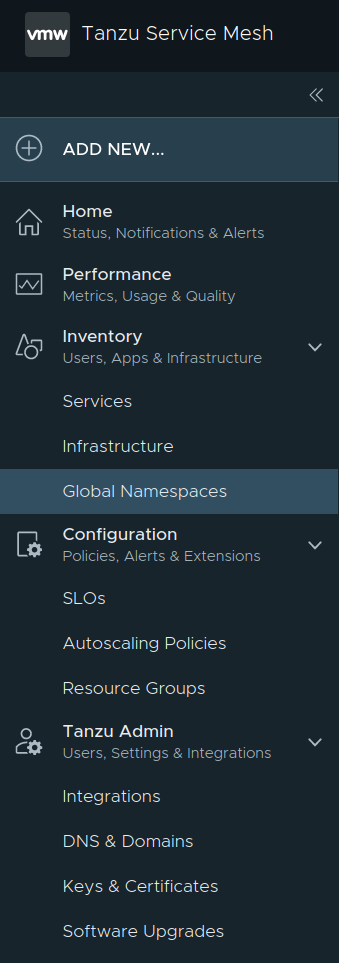


### General Details


### Define Service Mapping


### Create a Public Services

Follow these [instructions](https://docs.vmware.com/en/VMware-Tanzu-Service-Mesh/services/using-tanzu-service-mesh-guide/GUID-58A3FA7C-4EFC-44B2-B37B-D2152CB16359.html).


### (Optional) Add Health Checks


### Configuration Summary


Profit!
