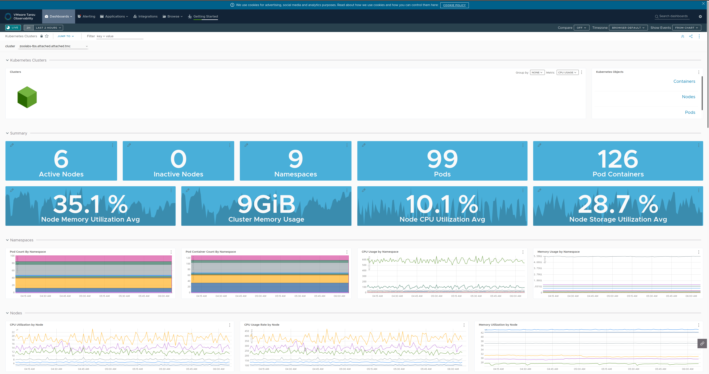
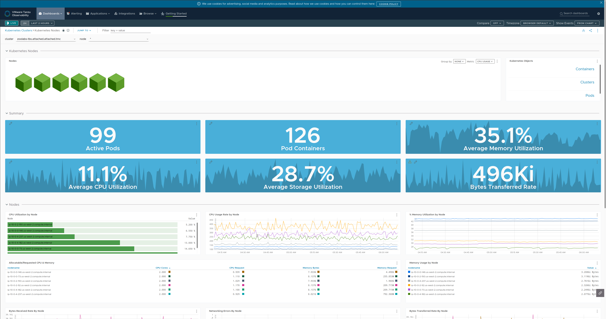
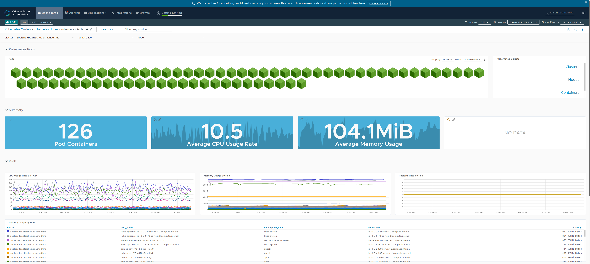
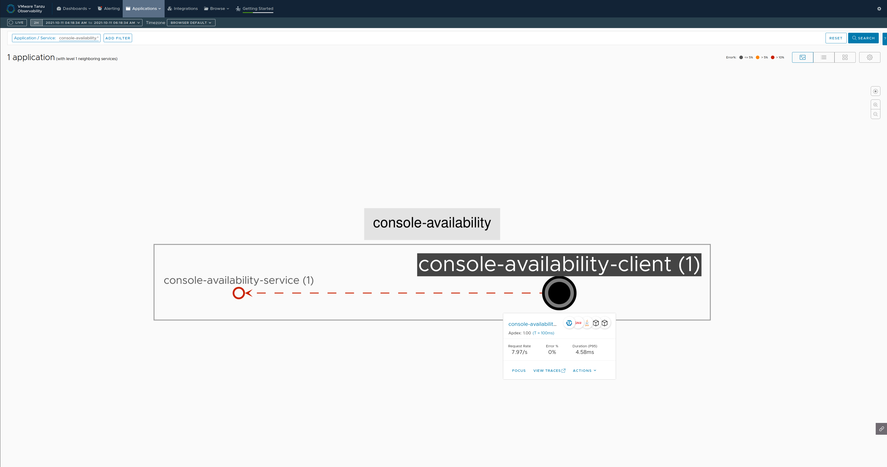
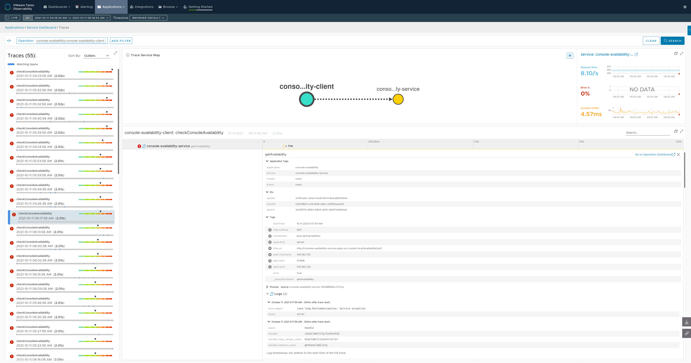

# Observability, Metrics and Call Tracing for Microservices

Identify and target a workload cluster.

If your workload cluster is registered or attached with Tanzu Mission Control, then [integrate](https://docs.wavefront.com/integrations_tmc_howto.html) it with Tanzu Observability.


## (Optionally) Fetch the source

```
git clone https://github.com/pacphi/tut-metrics-and-tracing
```


## Publish images

### Client

```
kp image save client \
  --git https://github.com/pacphi/tut-metrics-and-tracing \
  --sub-path basic/client \
  --git-revision ba8e45286007b53b6627b045b17bf8e7c8a15993 \
  --tag harbor.lab.zoolabs.me/apps/client \
  --registry-ca-cert-path /home/ubuntu/.local/share/mkcert/rootCA.crt \
  --env BP_JVM_VERSION=17 \
  --wait
```
> You will want to update the `--tag` and `--registry-ca-cert-path` values according to your particular setup.

Tail end of sample output

```
Saving harbor.lab.zoolabs.me/apps/client...
*** Images (sha256:324a3b0c69237067eac38abbe2c632f83afb3044f5ed6efd83d00caf5bf9ada5):
      harbor.lab.zoolabs.me/apps/client
      harbor.lab.zoolabs.me/apps/client:b19.20211008.211819
Reusing cache layer 'paketo-buildpacks/bellsoft-liberica:jdk'
Adding cache layer 'paketo-buildpacks/maven:application'
Reusing cache layer 'paketo-buildpacks/maven:cache'
Reusing cache layer 'paketo-buildpacks/maven:maven'
===> COMPLETION
Build successful
```

### Server

```
kp image save server \
  --git https://github.com/pacphi/tut-metrics-and-tracing \
  --sub-path basic/service \
  --git-revision ba8e45286007b53b6627b045b17bf8e7c8a15993 \
  --tag harbor.lab.zoolabs.me/apps/server \
  --registry-ca-cert-path /home/ubuntu/.local/share/mkcert/rootCA.crt \
  --env BP_JVM_VERSION=17 \
  --wait
```
> Again, you will want to update the `--tag` and `--registry-ca-cert-path` values according to your particular setup.

Tail end of sample output

```
Saving harbor.lab.zoolabs.me/apps/server...
*** Images (sha256:5e71ab5f611763288e26b2a72829c62066b2b181953713c341cf78cb46b0784e):
      harbor.lab.zoolabs.me/apps/server
      harbor.lab.zoolabs.me/apps/server:b9.20211008.062930
Reusing cache layer 'paketo-buildpacks/bellsoft-liberica:jdk'
Reusing cache layer 'paketo-buildpacks/maven:application'
Reusing cache layer 'paketo-buildpacks/maven:cache'
Reusing cache layer 'paketo-buildpacks/maven:maven'
===> COMPLETION
Build successful
```


## Update the manifests

We're going to use the same `k8s-manifests` [repository](https://github.com/pacphi/k8s-manifests) we did for the `primes` application.

You'll want to [duplicate](https://docs.github.com/en/repositories/creating-and-managing-repositories/duplicating-a-repository) the aforementioned repository.  Then update the registry repo name and image SHAs in each of the `client` and `server` directory's `config.yml` files.


## Setup up continuous deployment

### Public manifests

#### Server

```
cat > console-availability-server-cd-via-gitrepo.yml <<EOF
apiVersion: kappctrl.k14s.io/v1alpha1
kind: App
metadata:
  name: console-availability-service
  namespace: {namespace}
spec:
  serviceAccountName: {namespace}-ns-sa
  fetch:
  - git:
      url: https://github.com/pacphi/k8s-manifests
      ref: origin/main
      subPath: com/vmware/console-availability/server/{namespace}
  template:
  - ytt: {}
  deploy:
  - kapp: {}
EOF
```
> Replace occurrences of `{namespace}` with the namespace you want to deploy an instance of the server into.

```
kapp deploy -a console-availability-server -f console-availability-server-cd-via-gitrepo.yml -y
```

#### Client

```
cat > console-availability-client-cd-via-gitrepo.yml <<EOF
apiVersion: kappctrl.k14s.io/v1alpha1
kind: App
metadata:
  name: console-availability-client
  namespace: {namespace}
spec:
  serviceAccountName: {namespace}-ns-sa
  fetch:
  - git:
      url: https://github.com/pacphi/k8s-manifests
      ref: origin/main
      subPath: com/vmware/console-availability/client/{namespace}
  template:
  - ytt: {}
  deploy:
  - kapp: {}
EOF
```
> Replace occurrences of `{namespace}` with the namespace you want to deploy an instance of the client into.

```
kapp deploy -a console-availability-client -f console-availability-client-cd-via-gitrepo.yml -y
```


### Private manifests

In this case, the App CR will need to reference a secret that contains a personal access token with access to the Git repository.
> More likely if you're designing and developing solutions within an enterprise.

For convenience sake, here's a short compendium of links to instructions for how to acquire a personal access token from popular Git vendors:

* [Azure DevOps](https://docs.microsoft.com/en-us/azure/devops/organizations/accounts/use-personal-access-tokens-to-authenticate?view=azure-devops&tabs=preview-page)
* [Bitbucket](https://confluence.atlassian.com/bitbucketserver/personal-access-tokens-939515499.html)
* [Github](https://docs.github.com/en/authentication/keeping-your-account-and-data-secure/creating-a-personal-access-token)
* [Gitlab](https://docs.gitlab.com/ee/user/profile/personal_access_tokens.html)

#### Create the secret

Create some environment variables

```
export USERNAME='{username}'
export PAT='{personal-access-token}'
```
> Replace `{username}` and `{personal-access-token}` with valid credentials to access the remote private Git repository containing the Kubernetes manifests.

Create the secret

```
cat > git-pat-secret.yml <<EOF
apiVersion: v1
kind: Secret
metadata:
  name: git-pat-secret
  namespace: {namespace}
type: kubernetes.io/basic-auth
stringData:
  username: $USERNAME
  password: $PAT
EOF

kubectl apply -f git-pat-secret.yml
```
> Replace occurrences of `{namespace}` with the namespace you want to deploy an instances of the client and server into.

#### Server

```
cat > console-availability-server-cd-via-private-gitrepo.yml <<EOF
apiVersion: kappctrl.k14s.io/v1alpha1
kind: App
metadata:
  name: console-availability-service
  namespace: {namespace}
spec:
  serviceAccountName: {namespace}-ns-sa
  fetch:
  - git:
      url: https://github.com/pacphi/k8s-manifests-private
      ref: origin/main
      secretRef:
        name: git-pat-secret
      subPath: com/vmware/console-availability/server/{namespace}
  template:
  - ytt: {}
  deploy:
  - kapp: {}
EOF
```
> Replace occurrences of `{namespace}` with the namespace you want to deploy an instance of the server into.

```
kapp deploy -a console-availability-server -f console-availability-server-cd-via-private-gitrepo.yml -y
```

#### Client

```
cat > console-availability-client-cd-via-private-gitrepo.yml <<EOF
apiVersion: kappctrl.k14s.io/v1alpha1
kind: App
metadata:
  name: console-availability-client
  namespace: {namespace}
spec:
  serviceAccountName: {namespace}-ns-sa
  fetch:
  - git:
      url: https://github.com/pacphi/k8s-manifests-private
      ref: origin/main
      secretRef:
        name: git-pat-secret
      subPath: com/vmware/console-availability/client/{namespace}
  template:
  - ytt: {}
  deploy:
  - kapp: {}
EOF
```
> Replace occurrences of `{namespace}` with the namespace you want to deploy an instance of the client into.

```
kapp deploy -a console-availability-client -f console-availability-client-cd-via-private-gitrepo.yml -y
```

## What can we take a look at?

### Cluster Metrics



### Node Metrics



### Pod Metrics



### Application Status



### Application Tracing



## Tear down applications

```
kapp delete -a console-availability-client -y
kapp delete -a console-availability-service -y
```

## Additional references

* Kubernetes [Monitoring and Observability](https://tanzu.vmware.com/content/vmware-tanzu-observability-solutions/kubernetes-monitoring-and-observability)
  * Integration [How to](https://docs.wavefront.com/kubernetes.html)
  * [Monitor and scale](https://docs.wavefront.com/wavefront_kubernetes.html)
* Kubernetes [secrets](https://kubernetes.io/docs/concepts/configuration/secret/)
* [Monitoring for Spring Boot](https://docs.wavefront.com/wavefront_springboot.html)
* [Tutorial for Instrumenting an OpenTracing Java Application](https://docs.wavefront.com/tracing_java_tutorial.html#view-data-in-wavefront)
