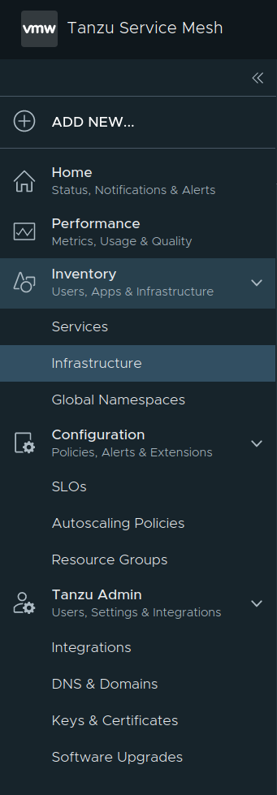

# Exploring Tanzu Service Mesh

We're going to provision two workload clusters, integrate them with Tanzu Service Mesh, deploy some apps,  configure a Global Namespace, define a public service and execute an application failover scenario the result of which should demonstrate resiliency and high-availability across clusters (no matter where they're running).

Assumes you have access to Harbor (or other container image registry) from which to source container images for the applications you'll deploy.


## Create workload clusters

We're just going to create a couple clusters in the same region but in different availability zones.  We assume a management cluster is already provisioned.

```
cat > zoolabs-workload-1.yml <<EOF
CLUSTER_NAME: zoolabs-workload-1
CLUSTER_PLAN: dev
NAMESPACE: default
CNI: antrea
IDENTITY_MANAGEMENT_TYPE: none
CONTROL_PLANE_MACHINE_TYPE: t3.large
NODE_MACHINE_TYPE: m5.xlarge
AWS_REGION: "us-west-2"
AWS_NODE_AZ: "us-west-2a"
AWS_SSH_KEY_NAME: "se-cphillipson-cloudgate-aws-us-west-2"
BASTION_HOST_ENABLED: false
ENABLE_MHC: true
MHC_UNKNOWN_STATUS_TIMEOUT: 5m
MHC_FALSE_STATUS_TIMEOUT: 12m
ENABLE_AUDIT_LOGGING: false
ENABLE_DEFAULT_STORAGE_CLASS: true
CLUSTER_CIDR: 100.96.0.0/11
SERVICE_CIDR: 100.64.0.0/13
ENABLE_AUTOSCALER: false
EOF

cat > zoolabs-workload-2.yml <<EOF
CLUSTER_NAME: zoolabs-workload-2
CLUSTER_PLAN: dev
NAMESPACE: default
CNI: antrea
IDENTITY_MANAGEMENT_TYPE: none
CONTROL_PLANE_MACHINE_TYPE: t3.large
NODE_MACHINE_TYPE: m5.xlarge
AWS_REGION: "us-west-2"
AWS_NODE_AZ: "us-west-2b"
AWS_SSH_KEY_NAME: "se-cphillipson-cloudgate-aws-us-west-2"
BASTION_HOST_ENABLED: false
ENABLE_MHC: true
MHC_UNKNOWN_STATUS_TIMEOUT: 5m
MHC_FALSE_STATUS_TIMEOUT: 12m
ENABLE_AUDIT_LOGGING: false
ENABLE_DEFAULT_STORAGE_CLASS: true
CLUSTER_CIDR: 100.96.0.0/11
SERVICE_CIDR: 100.64.0.0/13
ENABLE_AUTOSCALER: false
EOF

tanzu cluster create --file zoolabs-workload-1.yml
tanzu cluster create --file zoolabs-workload-2.yml

tanzu cluster scale zoolabs-workload-1 --worker-machine-count 3
tanzu cluster scale zoolabs-workload-2 --worker-machine-count 3
```
> You'll want to change a few of the values for the properties of each cluster's configuration above; minimally `CLUSTER_NAME` and `AWS_SSH_KEY_NAME`. Also, it's worth mentioning that you'll want to specify a `NODE_MACHINE_TYPE` that has at least 4 CPU. It'll take ~15-20 minutes to provision the supporting infrastructure and scale the worker nodes for each cluster.

Obtain the new workload cluster kubectl configuration.

```
tanzu cluster kubeconfig get zoolabs-workload-1 --admin
tanzu cluster kubeconfig get zoolabs-workload-2 --admin
```


## Integrate clusters with Tanzu Service Mesh

While we could [enable TSM for an organization](https://docs.vmware.com/en/VMware-Tanzu-Mission-Control/services/tanzumc-using/GUID-ABEEC120-5B2C-4D26-BD5D-C6BE71102154.html) then [integrate both clusters with TSM](https://docs.vmware.com/en/VMware-Tanzu-Mission-Control/services/tanzumc-using/GUID-5B1445AB-EFEB-41BD-B9B3-6DD38E69991F.html) via Tanzu Mission Control, we're going to follow these instructions:

* [Create an IAM policy for managing domain records in a Route53 hosted zone](../../harbor/README.md#create-an-iam-policy-for-managing-subdomain-records-in-a-route53-hosted-zone)
  * Referring to [Amazon Route 53 API permissions: Actions, resources, and conditions reference](https://docs.aws.amazon.com/Route53/latest/DeveloperGuide/r53-api-permissions-ref.html)
* [Create account, attach policy, and obtain credentials](../../harbor/README.md#create-account-attach-policy-and-obtain-credentials)
* [Manage integration](https://docs.vmware.com/en/VMware-Tanzu-Service-Mesh/services/using-tanzu-service-mesh-guide/GUID-C1321224-0298-40C9-91DC-4C2467886CEA.html)

A visual montage...


> You are creating a _Domain provider_.


## Manage Domain(s)

Follow these [instructions](https://docs.vmware.com/en/VMware-Tanzu-Service-Mesh/services/using-tanzu-service-mesh-guide/GUID-14107FE9-6CC7-477A-81C8-15A6DE7EE3F0.html).

A visual montage...


## (Optional) Manage Certificates

If you want to be able to encrypt traffic using TLS, then you will need to manage keys and certificates.

Follow these [instructions](https://docs.vmware.com/en/VMware-Tanzu-Service-Mesh/services/using-tanzu-service-mesh-guide/GUID-F918A006-AB74-4286-A7E7-D57F2326ECC6.html).


## Onboard clusters to TSM

Rinse-and-repeat these instructions for each cluster
  * See [Onboard a Cluster to Tanzu Service Mesh
](https://docs.vmware.com/en/VMware-Tanzu-Service-Mesh/services/getting-started-guide/GUID-DE9746FD-8369-4B1E-922C-67CF4FB22D21.html)

A visual montage...




That last screenshot is multi-step.  Make sure you pay attention to detail.  Supply names for the clusters (in each dialog box).  Generate the security token.  Target a workload cluster, apply the YAML (to register then connect), then choose whether to install TSM cluster-wide or in just certain namespaces (honoring excludes), then click on Install Tanzu Service Mesh.  Rinse-and-repeat for the second and subsequent clusters.


## Deploy applications to both clusters

Rinse-and-repeat these instructions targeting each cluster:

* [primes](../../carvel/README.md)
  * Employ Option 1
* [console-availability](../observability/README.md)
  * Choose to follow one section's steps (employing _Public_ or _Private_ manifests)


## Create Global Namespace

Once both clusters are integrated we will create a Global Namespace.

Follow these [instructions](https://docs.vmware.com/en/VMware-Tanzu-Service-Mesh/services/using-tanzu-service-mesh-guide/GUID-8D483355-6F58-4AAD-9EAF-3B8E0A87B474.html).

> Note: the Global Namespace name should never be named the same as the Domain name.

A visual montage...


### General Details


> Make sure that the Domain is not set to your real domain.


### Define Service Mapping


### Create a Public Services

Follow these [instructions](https://docs.vmware.com/en/VMware-Tanzu-Service-Mesh/services/using-tanzu-service-mesh-guide/GUID-58A3FA7C-4EFC-44B2-B37B-D2152CB16359.html).


### (Optional) Add Health Checks

Here's what no checks configuration looks like...


### Configuration Summary


## Make use of GNS domain in console-availability-client

Whew! You'd think you were done by now.

For the _primes_ app, since it's a simple micro-service application, so you are done with that one.  But the _console availability_ application consists of two micro-services: a _client_ and a _server_.  The _client_ to this point has been [configured](https://github.com/pacphi/k8s-manifests/blob/main/com/vmware/console-availability/client/apps/values.yml#L7) to interact with the _server_ via a [cluster local DNS service name](https://kubernetes.io/docs/concepts/services-networking/dns-pod-service/#a-aaaa-records).


To leverage service discovery within the mesh, and to facilitate failover in case of a pod or cluster failure
(where a server instance would become unavailable), we'll want to update the configuration of the client to employ the GNS domain.

### Update GNS domain in manifest

Fork and clone either of https://github.com/pacphi/k8s-manifests or https://github.com/pacphi/k8s-manifests-private.  Then make the necessary update.

E.g.,

```
git clone ... # fill in the rest targeting your fork
git checkout mesh
cd k8s-manifests/com/vmware/console-availability/client/apps
sed -i 's/apps.svc.cluster.local/{gns-domain}/g' values.yml
```
> Replace `{gns-domain}` above with your actual GNS domain.

Commit and push the update.

```
git add .
git commit -m "Update GNS domain"
git push -u origin mesh
```

### Update App CR

```
kubectl edit app console-availability-client -n apps
```

Look for `spec.fetch.git.ref` and update the value to be `origin/mesh`.

Then save your changes and exit from the editor.  (If you're relying on `vi`, type `:wq`)

Guess what? You're still not done. You need to rinse-and-repeat the above edit targeting your other cluster to be truly resilient.  Do that now.

Congratulations! You've just completed multi-cluster, high-availability deployments of two applications.

Here's what things should look like now...


## Validating Route53

You should see some new records in the hosted zone(s) you permitted Tanzu Service Mesh to access and write to.


## Testing access to a public service

Let's test that we can interact with the service we exposed.

```
curl http://primes.lab.zoolabs.me/primes/1/50 | jq
```
> Your domain may be different than what's in the example above.

Sample output

```
  % Total    % Received % Xferd  Average Speed   Time    Time     Time  Current
                                 Dload  Upload   Total   Spent    Left  Speed
100    72    0    72    0     0    545      0 --:--:-- --:--:-- --:--:--   545
{
  "end": 50,
  "primes": [
    2,
    3,
    5,
    7,
    11,
    13,
    17,
    19,
    23,
    29,
    31,
    37,
    41,
    43,
    47
  ],
  "start": 1
}
```

## Configuring failover

Start by targeting a cluster.

We're going to simulate application failure by reconfiguring the _liveness probe_ of an application in a cluster.  Because we have configured continuous deployment we can't just _edit_ or _patch_ an existing _deployment_.  Instead, we will create a branch on the git repository (where the deployment manifests are maintained) and make an update to the manifest like so:

```
git branch broken
git checkout broken
cd com/vmware/console-availability/server/apps
sed -i '0,/health/{s/health/broken/}' config.yml
```
> Assumes you've checked out and have been working with a fork of source from either https://github.com/pacphi/k8s-manifests or https://github.com/pacphi/k8s-manifests-private.

Commit and push the update.

```
git add .
git commit -m "Intentionally break liveness probe"
git push -u origin broken
```

It's not enough to have made the update to the manifest on the branch to trigger a deployment.  Why? Because the [original App CR](../observability/README.md#server-1) was configured to watch for updates on `origin/main`.

So we need to update the App CR as well to have it point to our new branch.  The easiest way to do this is to

```
kubectl edit app primes-dev -n apps
```

Look for `spec.fetch.git.ref` and update the value to be `origin/broken`.

Then save your changes and exit from the editor.  (If you're relying on `vi`, type `:wq`)

After a few moments, go have another look the GNS Topology view.  You should see that clients in both clusters failover to the available server instance in one cluster.

Pretty neat, huh?
