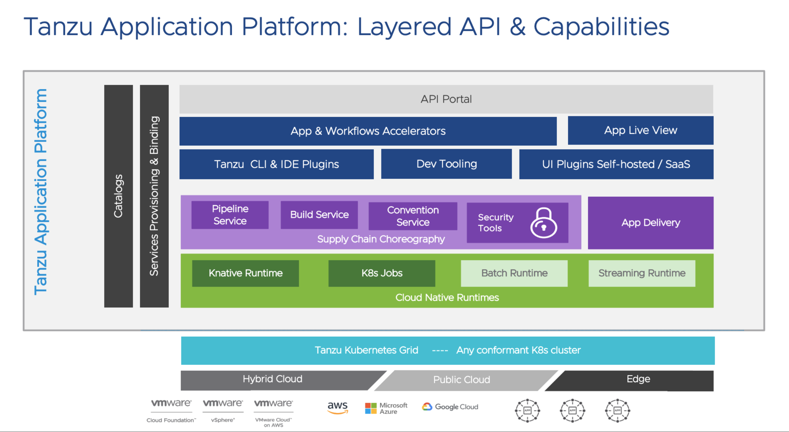
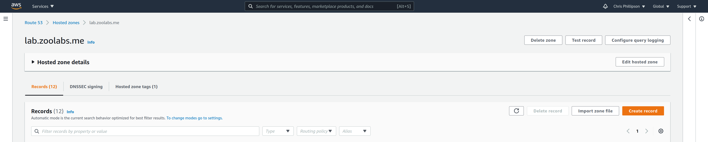
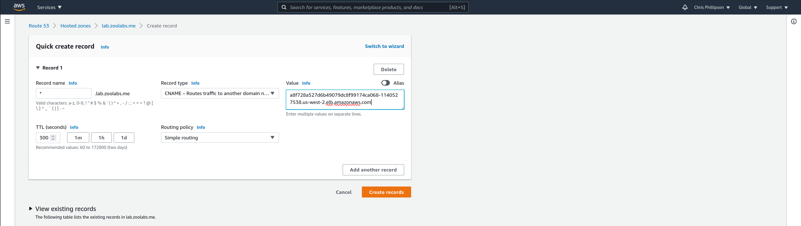

# Tanzu Application Platform Quickstart Installation Guide

> Note that Tanzu Application Platform is in Beta.  These instructions are based upon the Beta 3 release builds.




## Create a new workload cluster

We're going to do this on AWS.

```
cat > zoolabs-app-platform.yml <<EOF
CLUSTER_NAME: zoolabs-app-platform
CLUSTER_PLAN: dev
NAMESPACE: default
CNI: antrea
IDENTITY_MANAGEMENT_TYPE: none
CONTROL_PLANE_MACHINE_TYPE: t3.large
NODE_MACHINE_TYPE: m5.xlarge
AWS_REGION: "us-west-2"
AWS_NODE_AZ: "us-west-2b"
AWS_SSH_KEY_NAME: "se-cphillipson-cloudgate-aws-us-west-2"
BASTION_HOST_ENABLED: false
ENABLE_MHC: true
MHC_UNKNOWN_STATUS_TIMEOUT: 5m
MHC_FALSE_STATUS_TIMEOUT: 12m
ENABLE_AUDIT_LOGGING: false
ENABLE_DEFAULT_STORAGE_CLASS: true
CLUSTER_CIDR: 100.96.0.0/11
SERVICE_CIDR: 100.64.0.0/13
ENABLE_AUTOSCALER: false
EOF

tanzu cluster create --file zoolabs-app-platform.yml

tanzu cluster scale zoolabs-app-platform --worker-machine-count 3
```
> Replace occurrences of `zoolabs-app-platform` above with whatever name you'd like to give the workload cluster.  You'll also want to replace the value of `AWS_SSH_KEY_NAME` with your own SSH key.  Other property values may be updated as appropriate.


Obtain the new workload cluster kubectl configuration.

```
tanzu cluster kubeconfig get zoolabs-app-platform --admin
```
> Replace occurrence of `zoolabs-app-platform` above with name you gave the workload cluster.

Sample output

```
Credentials of cluster 'zoolabs-app-platform' have been saved
You can now access the cluster by running 'kubectl config use-context zoolabs-app-platform-admin@zoolabs-app-platform'
```

## Upgrade kapp-controller

### Verify installed version

```
kubectl get deployment kapp-controller -n tkg-system -o yaml | grep kapp-controller.carvel.dev/version
```
> You should see version 0.23.0 if you've installed Tanzu Kubernetes Grid 1.4 or Tanzu Community Edition.  We need to delete this version and install a newer version of the kapp-controller.

### Install newer version

Log into management cluster

```
kubectl config use-context zoolabs-mgmt-admin@zoolabs-mgmt
```
> Replace `zoolabs-mgmt` with your own management cluster name.

Apply this patch

```
kubectl patch app/zoolabs-app-platform-kapp-controller -n default -p '{"spec":{"paused":true}}' --type=merge
```
> Replace `zoolabs-app-platform` with your own workload cluster name.

Login to workload cluster, teardown the existing kapp-controller deployment, and deploy a new version of kapp-controller.

```
kubectl config use-context zoolabs-app-platform-admin@zoolabs-app-platform
kubectl delete deployment kapp-controller -n tkg-system
kubectl apply -f https://github.com/vmware-tanzu/carvel-kapp-controller/releases/download/v0.30.0/release.yml
```
> Replace occurrence of `zoolabs-app-platform-admin@zoolabs-app-platform` with your own workload cluster context.


### Verify new release version installed

```
kubectl get deployment kapp-controller -n kapp-controller -o yaml | grep kapp-controller.carvel.dev/version
```

### How to undo patch to management cluster

> This scenario only applies when you may have destroyed a workload cluster hosting TAP, then attempted to create a new workload cluster of the same name.

You will need to undo the patch.  If you forget to do this then the workload cluster creation will stall.

Check with:

```
kubectl get app zoolabs-app-platform-kapp-controller -n default
```
> Replace `zoolabs-app-platform` with your own workload cluster name.

To fix:

```
kubectl config use-context zoolabs-mgmt-admin@zoolabs-mgmt
kubectl patch app/zoolabs-app-platform-kapp-controller -n default -p '{"spec":{"paused":false}}' --type=merge
```
> Replace `zoolabs-mgmt` with your own management cluster name and replace `zoolabs-app-platform` with your own workload cluster name.

After a few moments check in on the status of the cluster with:

```
tanzu cluster list
```

Your cluster should be up-and-running.

## Install secret-gen-controller

```
kapp deploy -y -a sg -f https://github.com/vmware-tanzu/carvel-secretgen-controller/releases/download/v0.7.1/release.yml
```

Verify install

```
kubectl get deployment secretgen-controller -n secretgen-controller -o yaml | grep secretgen-controller.carvel.dev/version
```

## Add the Tanzu Application Platform specific plugins

> This procedure expects that you want to maintain the Tanzu CLI core and plugins you installed previously for interacting with Tanzu Kubernetes Grid or Tanzu Community Edition.

You'll want to copy and save the contents of the [install-tap-plugins.sh](install-tap-plugins.sh) to the machine where you had previously installed and used the `tanzu` CLI.

```
./install-tap-plugins.sh {tanzu-network-api-token}
```
> Replace `{tanzu-network-api-token}` with a valid VMWare Tanzu Network [API Token](https://network.pivotal.io/users/dashboard/edit-profile).

Note: after you install the TAP plugins in this manner you will not be able to successfully complete `tanzu cluster create` with the `v0.10.0` `package` plugin.  You will need to revert back to the `v1.4.0` version.  To do that, run:

```
tanzu plugin delete package
tanzu plugin install package --local {path-to-cli-directory}
```
> Replace `{path-to-cli-directory}` with a relative path to the `cli` directory that hosts the `v1.4.0` version.  If you're using a jump box, it's typically just `$HOME/cli`.


## Add the Tanzu Application Platform Package Repository

Create a new namespace

```
kubectl create ns tap-install
```

Create a registry secret

```
tanzu secret registry add tap-registry \
  --username "{tanzu-network-username}" --password "{tanzu-network-password}" \
  --server registry.tanzu.vmware.com \
  --export-to-all-namespaces --yes --namespace tap-install
```
> Replace `{tanzu-network-username}` and `{tanzu-network-password}` with the account credentials that you use to authenticate to the VMware Tanzu Network.


Add Tanzu Application Platform package repository to the cluster by running:

```
tanzu package repository add tanzu-tap-repository \
  --url registry.tanzu.vmware.com/tanzu-application-platform/tap-packages:0.3.0 \
  --namespace tap-install
```

Get the status of the Tanzu Application Platform package repository, and ensure the status updates to `Reconcile succeeded` by running:

```
tanzu package repository get tanzu-tap-repository --namespace tap-install
```

List the available packages by running:

```
tanzu package available list --namespace tap-install
```

List versions of available packages.  You'll want to copy and save the contents of the [list-available-packages.sh](list-available-packages.sh) to the machine where you had previously installed and used the `tanzu` CLI.

Then run:

```
./list-available-packages.sh
```

## Install a Tanzu Application Platform Profile

To view possible configuration settings, run:

```
tanzu package available get tap.tanzu.vmware.com/0.3.0 --values-schema --namespace tap-install
```
> Note that currently that the `tap.tanzu.vmware.com` package does not show all configuration settings for packages it plans to install. To find them out, look at the individual package configuration settings via same `tanzu package available get` command (e.g. for CNRs use `tanzu package available get -n tap-install cnrs.tanzu.vmware.com/1.0.3 --values-schema`). Replace dashes with underscores. For example, if the package name is `cloud-native-runtimes`, use `cloud_native_runtimes` in the `tap-values` YAML file.

Let's create a sample `tap-values.yml` file:

```
cat > tap-values.yml << EOF
profile: full

buildservice:
  kp_default_repository: "{container-registry-domain}/platform/app"
  kp_default_repository_username: "{container-registry-username}"
  kp_default_repository_password: "{container-registry-password}"
  tanzunet_username: "{tanzu-network-username}"
  tanzunet_password: "{tanzu-network-password}"

ootb_supply_chain_basic:
  registry:
    server: "{container-registry-domain}"
    repository: "platform/app"

ootb_supply_chain_testing_scanning:
  registry:
    server: "{container-registry-domain}"
    repository: "platform/app"

ootb_supply_chain_testing:
  registry:
    server: "{container-registry-domain}"
    repository: "platform/app"

learningcenter:
  ingressDomain: "{domain}"
  ingressClass: contour-external
  ingressSecret:
    secretName: knative-tls
  server:
    service_type: ClusterIP

tap_gui:
  service_type: LoadBalancer

appliveview:
  connector_namespaces: [default]
  service_type: LoadBalancer
EOF
```
> Replace curly-bracketed value-placeholders with real values. The `buildservice.kp_default_repository` and `ootb_supply_chain_*.registry.repository` values should be the same.  If you're integrating with a Harbor registry then the convention is `{harbor-domain}/{project}/{repository}`.  The `{project}` must be created and exist before you attempt the `tanzu package install` below.  The `{repository}` will be created automatically if it doesn't already exist.

Install the package by running:

```
tanzu package install tap -p tap.tanzu.vmware.com -v 0.3.0 --values-file tap-values.yml -n tap-install
```
> This will take some time.  Go grab a coffee and come back in 10 to 15 minutes.

Verify the package install by running:

```
tanzu package installed get tap -n tap-install
```
> Verify that the status for the installed package is "Reconcile succeeded".

Verify all the necessary packages in the profile are installed by running:

```
tanzu package installed list -A
```
> Sometimes the install will time out.  That's ok.  Attempt to execute the command above until you see something like the sample output below.  If any of the packages has a "Reconcile failed" you'll need to troubleshoot and fix before proceeding.

Sample output

```
ubuntu@ip-172-31-61-62:~$ tanzu package installed list -A
- Retrieving installed packages...
  NAME                                PACKAGE-NAME                                         PACKAGE-VERSION        STATUS                                                                NAMESPACE
  accelerator                         accelerator.apps.tanzu.vmware.com                    0.4.0                  Reconcile succeeded                                                   tap-install
  api-portal                          api-portal.tanzu.vmware.com                          1.0.3                  Reconcile succeeded                                                   tap-install
  appliveview                         appliveview.tanzu.vmware.com                         0.3.0                  Reconcile succeeded                                                   tap-install
  buildservice                        buildservice.tanzu.vmware.com                        1.3.1                  Reconcile succeeded                                                   tap-install
  cartographer                        cartographer.tanzu.vmware.com                        0.0.7                  Reconcile succeeded                                                   tap-install
  cnrs                                cnrs.tanzu.vmware.com                                1.0.3                  Reconcile succeeded                                                   tap-install
  conventions-controller              controller.conventions.apps.tanzu.vmware.com         0.4.2                  Reconcile succeeded                                                   tap-install
  developer-conventions               developer-conventions.tanzu.vmware.com               0.3.0                  Reconcile succeeded                                                   tap-install
  grype                               grype.scanning.apps.tanzu.vmware.com                 1.0.0-beta.2           Reconcile succeeded                                                   tap-install
  image-policy-webhook                image-policy-webhook.signing.run.tanzu.vmware.com    1.0.0-beta.1           Reconcile succeeded                                                   tap-install
  learningcenter                      learningcenter.tanzu.vmware.com                      1.0.14-build.1         Reconcile succeeded                                                  tap-install
  learningcenter-workshops            workshops.learningcenter.tanzu.vmware.com            1.0.7-build.1          Reconcile succeeded                                                   tap-install
  ootb-supply-chain-basic             ootb-supply-chain-basic.tanzu.vmware.com             0.3.0-build.5          Reconcile succeeded                                                   tap-install
  ootb-templates                      ootb-templates.tanzu.vmware.com                      0.3.0-build.5          Reconcile succeeded                                                   tap-install
  scanning                            scanning.apps.tanzu.vmware.com                       1.0.0-beta.2           Reconcile succeeded                                                   tap-install
  service-bindings                    service-bindings.labs.vmware.com                     0.5.0                  Reconcile succeeded                                                   tap-install
  services-toolkit                    services-toolkit.tanzu.vmware.com                    0.4.0                  Reconcile succeeded                                                   tap-install
  source-controller                   controller.source.apps.tanzu.vmware.com              0.1.2                  Reconcile succeeded                                                   tap-install
  spring-boot-conventions             spring-boot-conventions.tanzu.vmware.com             0.1.2                  Reconcile succeeded                                                   tap-install
  tap                                 tap.tanzu.vmware.com                                 0.3.0                  Reconcile succeeded                                                   tap-install
  tap-gui                             tap-gui.tanzu.vmware.com                             0.3.0-rc.4             Reconcile succeeded                                                   tap-install
  antrea                              antrea.tanzu.vmware.com                              0.13.3+vmware.1-tkg.1  Reconcile succeeded                                                   tkg-system
  metrics-server                      metrics-server.tanzu.vmware.com                      0.4.0+vmware.1-tkg.1   Reconcile succeeded                                                   tkg-system
```

### Updating TAP packages

To update all packages, run:

```
tanzu package installed update tap -v 0.3.0 --values-file tap-values.yml -n tap-install
```
> You'll need to do this when you add, adjust, or remove any key-value you specify in `tap-values.yml`.  Your mileage may vary.  The "nuclear" (and recommended) option if you're in a hurry is to just just delete the `tap` package and any lingering resources, then re-install.

### Setting up Ingress

We're going to adapt the setup process to automate it even more by employing [Let's Encrypt](https://letsencrypt.org/how-it-works/), [cert-manager](https://cert-manager.io/docs/configuration/acme/dns01/route53/), and [external-dns](https://github.com/kubernetes-sigs/external-dns/blob/master/docs/tutorials/aws.md) with [Contour](https://projectcontour.io/getting-started/).

TAP already installed Contour into the `contour-external` namespace.  We can verify that a `LoadBalancer` was created on your behalf by running:

```
kubectl get svc -n contour-external
```

#### Setting up an A or CNAME record for a wildcard Domain

The `envoy` service within the `contour-external` namespace references an ELB.

#### Install external-dns

TKG clusters include `external-dns` as part of the `tanzu-package-repo-global` namespace.  To verify this you can run:

```
tanzu package available list external-dns.tanzu.vmware.com -n tanzu-package-repo-global
```

Sample output

```
ubuntu@ip-172-31-61-62:~$ tanzu package available list external-dns.tanzu.vmware.com -n tanzu-package-repo-global
- Retrieving package versions for external-dns.tanzu.vmware.com...
  NAME                           VERSION               RELEASED-AT
  external-dns.tanzu.vmware.com  0.8.0+vmware.1-tkg.1  2021-06-11 11:00:00 -0700 PDT
```

We can check in on what we can configure

```
tanzu package available get external-dns.tanzu.vmware.com/0.8.0+vmware.1-tkg.1 --values-schema --namespace tanzu-package-repo-global
```

Let's install the external-dns package with a [script](install-external-dns-package-for-tkg-on-aws.sh)

```
./install-external-dns-package-for-tkg-on-aws.sh {aws-access-key-id} {aws-secret-access-key} {domain} {hosted-zone-id}
```
> This script simplifies the process of configuring and installing external-dns on your cluster hosted on AWS.  See step 6 [here](https://docs.vmware.com/en/VMware-Tanzu-Kubernetes-Grid/1.4/vmware-tanzu-kubernetes-grid-14/GUID-packages-external-dns.html#aws-route-53-4).  You will need to have [created an IAM Policy](../aws/HARBOR.md#create-an-iam-policy-for-managing-subdomain-records-in-a-route53-hosted-zone) with required permissions to interact with (a) target HostedZone(s) in Route53.

#### Manual DNS

If you chose not to install `external-dns`, then you will have to [manually add](https://docs.aws.amazon.com/Route53/latest/DeveloperGuide/resource-record-sets-creating.html) a wildcard domain as an `A` or `CNAME` record to the HostedZone within Route53.

To add an A record we'll want to configure Route53 to [route traffic to it via an alias record](https://docs.aws.amazon.com/Route53/latest/DeveloperGuide/routing-to-elb-load-balancer.html#routing-to-elb-load-balancer-configuring).

To add a CNAME record (e.g., when managing Route53 hosted zone record in a separate account)





> Change the wildcard domain and ELB address above to suit your needs.

#### Install a mkcert managed Certificate

> Recommended option if you've been following the Tanzu Advanced evaluation guide to this point.

We'll create a [ClusterIssuer](https://cert-manager.io/docs/concepts/issuer/) and [Certificate](https://kubernetes.io/docs/tasks/tls/managing-tls-in-a-cluster/), and [Secret](https://kubernetes.io/docs/concepts/configuration/secret/) on a TKG cluster on AWS where `cert-manager` is already installed.

```
./install-mkcert-for-tkg-on-aws.sh {domain} {path-to-cert-pem-filename} {path-to-key-pem-filename}
```

> The `.pem` files mentioned above should already exist if you had followed the instructions [here](../aws/HARBOR.md#install-ca).

#### Install a Let's Encrypt managed Certificate

> Use this option only when the container image registry you're interacting with has been configured to trust the same CA via Let's Encrypt.

We'll create a [ClusterIssuer](https://cert-manager.io/docs/concepts/issuer/) and [Certificate](https://kubernetes.io/docs/tasks/tls/managing-tls-in-a-cluster/), and [Secret](https://kubernetes.io/docs/concepts/configuration/secret/) on a TKG cluster on AWS where `cert-manager` is already installed.

```
./install-letsencrypt-cert-for-tkg-on-aws.sh {email-address} {aws-access-key-id} {aws-secret-access-key} {aws-region} {domain} {hosted-zone-id}
```
> This script also makes use of [kubernetes-reflector](https://github.com/emberstack/kubernetes-reflector#cert-manager-support) to automatically mirror the `knative-tls` secret in the `contour-external` namespace into the `educates` namespace.

#### Create a new Tanzu Application Platform GUI catalog

We're going to fetch some [baseline configuration](https://network.pivotal.io/products/tanzu-application-platform/#/releases/992949/file_groups/5756) for a _blank catalog_ from the Tanzu Network.

```
./fetch-tap-gui-catalog.sh {tanzu-network-api-token}
```
> Replace `{tanzu-network-api-token}` with a valid VMware Tanzu Network account [API Token](https://network.pivotal.io/users/dashboard/edit-profile).

Then we'll create a new Git repository to host the catalog.  (In this example we'll use Github, but you could target any git-compatible repository provider).

```
cd /tmp
tar xvf tap-gui-blank-catalog.tgz
cd blank
git init
gh repo create tap-gui-catalog
git branch -m master main
git add .
git status
git commit -m "Initial commit"
git push -u origin main --force
```


#### Update configuration

We're going to remove the last 6 lines of `tap-values.yml` that we created and used for the initial install of TAP, emitting a new file that we'll then append some updated configuration to.

```
head -n -6 tap-values.yml > /tmp/tap-values-updated.yml
```

```
cat <<EOT >> /tmp/tap-values-updated.yml
tap_gui:
  namespace: tap-gui
  service_type: ClusterIP
  app-config:
    app:
      baseUrl: https://tap-gui.{domain}
    integrations:
      github:
        - host: github.com
          token: {git-personal-access-token}
    catalog:
      locations:
        - type: url
          target: {git-repo}/catalog-info.yaml  # e.g., https://github.com/pacphi/tap-gui-catalog/blob/main/catalog-info.yaml
    backend:
        baseUrl: https://tap-gui.{domain}
        cors:
            origin: https://tap-gui.{domain}

accelerator:
  server:
    service_type: ClusterIP

appliveview:
  connector_namespaces: [default]
  service_type: ClusterIP
EOT
```
> Replace `{domain}` above with the domain you specified earlier.

Let's apply our updates.

```
tanzu package installed update tap -v 0.3.0 --values-file /tmp/tap-values-updated.yml -n tap-install
```

Next, we'll patch a set of `ConfigMap`s in the `knative-serving` namespace by following these steps:

```
cd /tmp
git clone https://github.com/pacphi/tap-ingress
cd tap-ingress
rm values-ingress.yaml

cat > values-ingress.yaml << EOF
#@data/values
---
domain: {domain}
tls:
  secretName: knative-tls
  namespace: contour-external
EOF

./configure-ingress.sh
```
> Replace `{domain}` above with the same domain you specified earlier.

We're almost done!

Need to kick a couple resources to get them to behave.  (This is a beta release after all).

* Delete the `server` pod in the `tap-gui` namespace

  ```
  kubectl delete po -l component=backstage-server -n tap-gui
  ```
* Delete the Learning Center `trainingportal` as it's stuck in a `Pending` state

  ```
  kubectl delete trainingportal educates-tutorials
  ```

> Don't worry both resources will automatically be re-created.


And finally we can execute:

```
kubectl get httpproxy -A
```

to see all of the HTTPS endpoints for the TAP components

Sample output

```
ubuntu@ip-172-31-61-62:/tmp/tap-ingress$ kubectl get httpproxy -A
NAMESPACE            NAME            FQDN                           TLS SECRET                     STATUS   STATUS DESCRIPTION
accelerator-system   accelerator     accelerator.lab.zoolabs.me     contour-external/knative-tls   valid    Valid HTTPProxy
app-live-view        app-live-view   app-live-view.lab.zoolabs.me   contour-external/knative-tls   valid    Valid HTTPProxy
tap-gui              tap-gui         tap-gui.lab.zoolabs.me         contour-external/knative-tls   valid    Valid HTTPProxy
```

### Installing the Visual Studio Code TAP Extension

You may use the convenience script to download a `.vsix` file for installation as an extension to [VSCode](https://code.visualstudio.com/).

```
./fetch-tap-vscode-extension.sh {tanzu-network-api-token}
```
> Replace `{tanzu-network-api-token}` with a valid VMWare Tanzu Network [API Token](https://network.pivotal.io/users/dashboard/edit-profile)


## Troubleshooting a Tanzu Application Platform Profile installation

### Problem with build-service

What would you do if you saw the following after executing `tanzu package installed list -A`?

```
buildservice                        buildservice.tanzu.vmware.com                        1.3.1                  Reconcile failed: Error (see .status.usefulErrorMessage for details)  tap-install
```

Start by getting more detail about the error by running:

```
tanzu package installed get buildservice -n tap-install
```

Sample output

```
ubuntu@ip-172-31-61-62:~$ tanzu package installed get buildservice -n tap-install
/ Retrieving installation details for buildservice...
NAME:                    buildservice
PACKAGE-NAME:            buildservice.tanzu.vmware.com
PACKAGE-VERSION:         1.3.1
STATUS:                  Reconcile failed: Error (see .status.usefulErrorMessage for details)
CONDITIONS:              [{ReconcileFailed True  Error (see .status.usefulErrorMessage for details)}]
USEFUL-ERROR-MESSAGE:    kapp: Error: waiting on reconcile tanzunetdependencyupdater/dependency-updater (buildservice.tanzu.vmware.com/v1alpha1) namespace: build-service:
  Finished unsuccessfully (Encountered failure condition Ready == False: CannotImportDescriptor (message:  "default" not ready: Get "https://harbor.lab.zoolabs.me/v2/": x509: certificate signed by unknown authority))
```

This is telling us that we're missing a CA.  What do we need to add to `tap-values.yml` then?

```
tanzu package available get buildservice.tanzu.vmware.com/1.3.1 --values-schema --namespace tap-install
```

Sample output

```
ubuntu@ip-172-31-61-62:~$ tanzu package available get buildservice.tanzu.vmware.com/1.3.1 --values-schema --namespace tap-install
| Retrieving package details for buildservice.tanzu.vmware.com/1.3.1...
  KEY                             DEFAULT  TYPE    DESCRIPTION
  kp_default_repository           <nil>    string  docker repository (required)
  kp_default_repository_password  <nil>    string  registry password (required)
  kp_default_repository_username  <nil>    string  registry username (required)
  tanzunet_password               <nil>    string  tanzunet registry password (required for dependency updater feature)
  tanzunet_username               <nil>    string  tanzunet registry username (required for dependency updater feature)
  ca_cert_data                    <nil>    string  tbs registry ca certificate (used for self signed registry)
```

So we'll need to add a child property key named `ca_cert_data:` and an associated multi-line value underneath `buildservice:`.

Then run:

```
tanzu package installed update tap -v 0.3.0 --values-file tap-values.yml -n tap-install
```

### Problem with tap-gui

Maybe you notice that the _Tanzu Application Platform GUI_ is missing an entry for the application you just deployed?

* Did you [install the blank catalog](#create-a-new-tanzu-application-platform-gui-catalog)?
* Did you [add an entry to catalog-info.yaml](USAGE.md#getting-your-app-to-appear-in-the-tanzu-application-platform-gui-catalog)?
* Is your entry referencing the correct branch and file? (e.g., a Github URL might look like `https://github.com/{owner-or-organization}/{project}/blob/{branch}/{filename}`)

Verify that the _app-config_ version has your updates.

```
kubectl get secrets -n tap-gui
kubectl get secret app-config-ver-{version} -n tap-gui -o "jsonpath={.data.app-config\.yaml}" | base64 -d
```
> Replace `{version}` above with the latest version of the secret available

If not, try

```
kubectl delete po -l component=backstage-server -n tap-gui
```

Then wait ~ 2 minutes and re-verify.


## How to use Tanzu Application Platform

Congratulations! You've managed to install TAP.  Now what?

Well, the answer to that question is only going to be partially addressed here.  The `full` platform profile is comprised of a number of components collectively delivering capabilities designed to help you go from idea to deployment with alacrity.

We'll touch on how to interact with a handful of those components here:

* Cloud Native Runtimes
  * [Verifying your Cloud Native Runtimes installation](https://docs.vmware.com/en/Cloud-Native-Runtimes-for-VMware-Tanzu/1.0/tanzu-cloud-native-runtimes-1-0/GUID-verify-installation.html)
    * As you walk through Knative Serving, Knative Eventing, and TriggerMesh SAWS you won't need to create a cluster role binding as this has been taken care of by the package.
  * [Enabling Automatic TLS Certificate Provisioning for Cloud Native Runtimes for Tanzu](https://docs.vmware.com/en/Cloud-Native-Runtimes-for-VMware-Tanzu/1.0/tanzu-cloud-native-runtimes-1-0/GUID-auto-tls.html)
* Application Accelerator
  * Visit `https://acclerator.{domain}` in your favorite browser.  Replace `{domain}` with your domain.
  * [Using Application Accelerator for VMware Tanzu](https://docs.vmware.com/en/Application-Accelerator-for-VMware-Tanzu/0.4/acc-docs/GUID-installation-install.html#access-the-application-accelerator-ui-server-1)
  * [Accelerator Commands](https://docs.vmware.com/en/Application-Accelerator-for-VMware-Tanzu/0.4/acc-docs/GUID-acc-cli.html#accelerator-commands-2)
  * [Creating Accelerators](https://docs.vmware.com/en/Application-Accelerator-for-VMware-Tanzu/0.4/acc-docs/GUID-creating-accelerators-index.html)
* [Application Live View](https://docs.vmware.com/en/Application-Live-View-for-VMware-Tanzu/0.3/docs/GUID-index.html)
  * Visit `https://app-live-view.{domain}` in your favorite browser.  Replace `{domain}` with your domain.
  * [Product Features](https://docs.vmware.com/en/Application-Live-View-for-VMware-Tanzu/0.3/docs/GUID-product-features.html)
* Tanzu Application Platform GUI
  * Visit `https://tap-gui.{domain}` in your favorite browser.  Replace `{domain}` with your domain.
  * Public [documentation](https://docs.vmware.com/en/VMware-Tanzu-Application-Platform/0.3/tap-0-3/GUID-tap-gui-about.html)
* Learning Center
  * You can check the Training Portals available in your environment running the following command `kubectl get trainingportals`
  * Public [documentation](https://docs.vmware.com/en/VMware-Tanzu-Application-Platform/0.3/tap-0-3/GUID-learning-center-about.html)
* API Portal
  * Visit `https://api-portal.{domain}` in your favorite browser.  Replace `{domain}` with your domain.
  * [Viewing APIs](https://docs.pivotal.io/api-portal/1-0/api-viewer.html)

A more detailed review of what capabilities a developer may leverage may be found [here](USAGE.md).  Also, to whet your appetite, please consult the section below entitled [For your consideration](#for-your-consideration).


## Uninstall Tanzu Application Platform

Delete the package install

```
tanzu package installed delete tap -n tap-install -y
```
> Be patient! This can take up to 10m or more.  It may even timeout.  Just wait a little longer.  Then verify that the only two packages remaining are: `antrea`, `external-dns` and `metrics-server` by executing `tanzu package installed list -A`.

Delete lingering resources

```
kubectl delete secret tap-tap-install-values -n tap-install
kubectl delete sa tap-tap-install-sa -n tap-install
kubectl delete clusterroles.rbac.authorization.k8s.io tap-tap-install-cluster-role
kubectl delete clusterrolebindings.rbac.authorization.k8s.io tap-tap-install-cluster-rolebinding
```

Delete the package repository

```
tanzu package repository delete tanzu-tap-repository -n tap-install
```


## Uninstall external-dns

Run this [script](uninstall-external-dns-package-for-tkg-on-aws.sh)

```
./uninstall-external-dns-package-for-tkg-on-aws.sh
```


## Uninstall the Let's Encrypt managed certificate

Run this [script](uninstall-letsencrypt-cert-for-tkg-on-aws.sh)

```
./uninstall-letsencrypt-cert-for-tkg-on-aws.sh
```

## Uninstall mkcert managed certificate

Run this [script](uninstall-mkcert-for-tkg-on-aws.sh)

```
./uninstall-mk-cert-for-tkg-on-aws.sh
```


## Teardown the cluster

```
tanzu cluster delete zoolabs-app-platform
kubectl config delete-context zoolabs-app-platform-admin@zoolabs-app-platform
```
> Replace occurrences of `zoolabs-app-platform` and `zoolabs-app-platform-admin@zoolabs-app-platform` with your own workload cluster name and context.


## For your consideration

* [Product page](https://tanzu.vmware.com/application-platform)
* Blogs
  * [Announcing VMware Tanzu Application Platform: A Better Developer Experience on any Kubernetes](https://tanzu.vmware.com/content/blog/announcing-vmware-tanzu-application-platform)
  * [VMware Tanzu Application Service: The Best Destination for Mission-Critical Business Apps](https://tanzu.vmware.com/content/blog/vmware-tanzu-application-service-best-mission-critical-business-apps)
  * [VMware Tanzu Application Platform Delivers a Paved Path to Production for Public Cloud and Kubernetes](https://tanzu.vmware.com/content/blog/vmware-tanzu-application-platform-beta-2-announcement)
  * [Software Supply Chain Choreography](https://tanzu.vmware.com/developer/guides/supply-chain-choreography/)
  * [Recognizing and Removing Friction Points in the Developer Experience on Kubernetes](https://tanzu.vmware.com/content/blog/removing-friction-points-developer-experience-kubernetes)
  * [Building Paths to Production with Cartographer](https://tanzu.vmware.com/content/blog/building-paths-to-production-cartographer)
* Analyst Reports
  * [VMware Tanzu Application Platform: Turning developer definition into a running Kubernetes pod](https://tanzu.vmware.com/content/vmware-tanzu-application-platform-resources/vmware-tanzu-application-platform-turning-developer-definition-into-a-running-kubernetes-pod)
* Demos
  * [VMware Tanzu Application Platform Creates a Better Developer Experience](https://www.youtube.com/watch?v=9oupRtKT_JM)
  * [VMware Tanzu Application Platform Developer Experience](https://www.youtube.com/watch?v=sMg7fg7FP28)
  * [How Tanzu Application Platform Improves the Inner Loop for Developers](https://www.youtube.com/watch?v=HDUjSSK2sdM)
* Conference sessions
  * SpringOne 2021
    * Keynote
      * [Intro](https://www.youtube.com/watch?v=2Qhj5u2bct0&t=264s)
      * [Demo](https://www.youtube.com/watch?v=2Qhj5u2bct0&t=882s)
    * Sessions
      * [Deploy Code Into Production Faster on Kubernetes](https://springone.io/2021/sessions/deploy-code-into-production-faster-on-kubernetes)
      * [Inner Loop Development with Spring Boot on Kubernetes](https://springone.io/2021/sessions/inner-loop-development-with-spring-boot-on-kubernetes)
  * VMworld 2021
    * Keynote
      * [VI3190 - DevSecOps Your Way to Any Cloud (And Delight Your Customers)](https://myevents.vmware.com/widget/vmware/vmworld2021/catalog?search=VI3190)
    * Breakout Sessions
      * [APP2479 - Introducing Tanzu Application Platform: A New Tanzu Developer Experience](https://myevents.vmware.com/widget/vmware/vmworld2021/catalog?search=APP2479)
      * [APP2482 - A developer-oriented application platform works better for ops too](https://myevents.vmware.com/widget/vmware/vmworld2021/catalog?search=APP2482)
      * [APP2109 - Steps to Implementing a More Secure Software Supply Chain in VMware Tanzu](https://myevents.vmware.com/widget/vmware/vmworld2021/catalog?search=APP2109)
      * [APP2483 - Speed the Path to Production with Application Accelerator for VMware Tanzu](https://myevents.vmware.com/widget/vmware/vmworld2021/catalog?search=APP2483)
    * Tech+ Tutorial
      * [APP2052 - Centralizing Your Software Supply Chain’s Metadata: A Key to the More Secure Software Supply Chain](https://myevents.vmware.com/widget/vmware/vmworld2021/catalog?search=APP2052)
      * [APP2089 - Building Native Spring Microservices on Kubernetes: Deep Dive](https://myevents.vmware.com/widget/vmware/vmworld2021/catalog?search=APP2089)
    * Meet the Expert
      * [APP2437 - Meet the Expert: VMware Tanzu Developer Experience](https://myevents.vmware.com/widget/vmware/vmworld2021/catalog?search=APP2437)
      * [APP2652 - Meet the Expert: Kubernetes-Centric App CI/CD](https://myevents.vmware.com/widget/vmware/vmworld2021/catalog?search=APP2652)
      * [APP2438 - Meet the Expert: Cloud Native Runtimes for VMware Tanzu](https://myevents.vmware.com/widget/vmware/vmworld2021/catalog?search=APP2438)
* Webinars
  * [No YOLO Ops: Securing the Software Supply Chain](https://tanzu.vmware.com/content/webinars/dec-3-no-yolo-ops-securing-the-software-supply-chain)
  * [So You Built a Kubernetes Platform, Now What?](https://tanzu.vmware.com/content/webinars/oct-28-so-you-built-a-kubernetes-platform-now-what-achieving-platform-economics-with-kubernetes)
* Press coverage
  * [VMware’s New Tanzu Platform Aims To Unify Kubernetes Development](https://www.infoworld.com/article/3631384/vmware-s-new-tanzu-platform-aims-to-unify-kubernetes-development.html)
  * [This too shall PaaS: VMware's new Tanzu Application Platform explained](https://www.theregister.com/2021/09/02/vmwares_new_tanzu_application_platform/)
  * [VMware Previews App Dev Platform for Kubernetes](https://containerjournal.com/editorial-calendar/vmware-previews-app-dev-platform-for-kubernetes/)
  * [VMware Tanzu Application Platform Reflects PaaS Shifts](https://myevents.vmware.com/widget/vmware/vmworld2021/catalog?search=APP2438)
